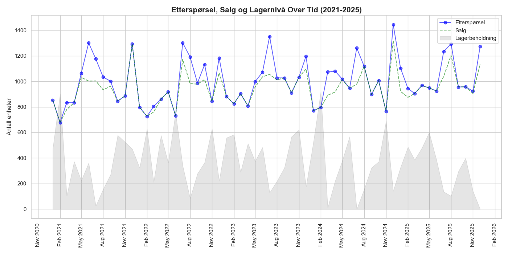
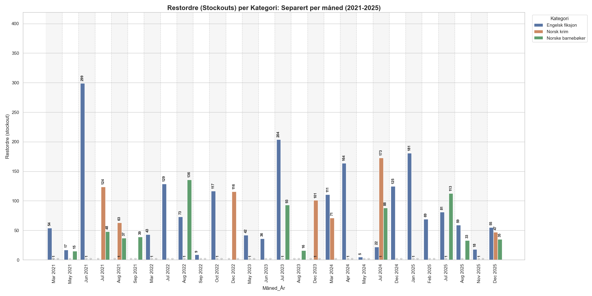
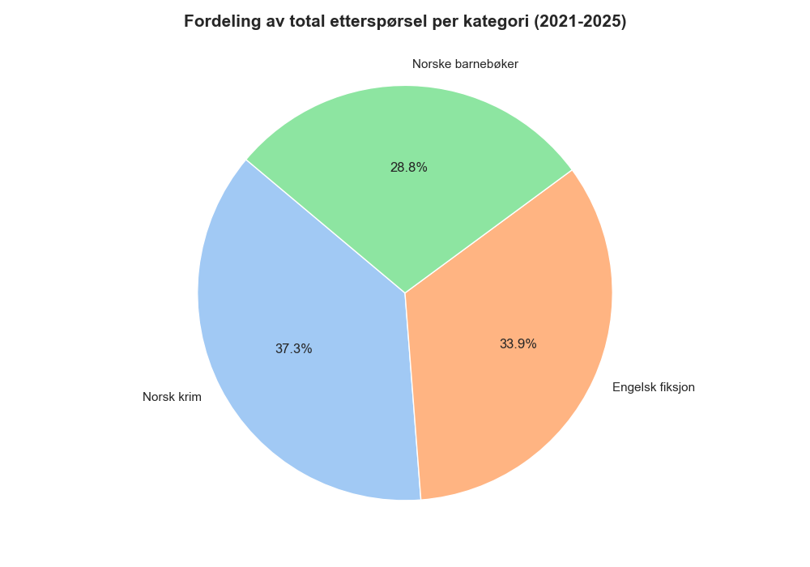
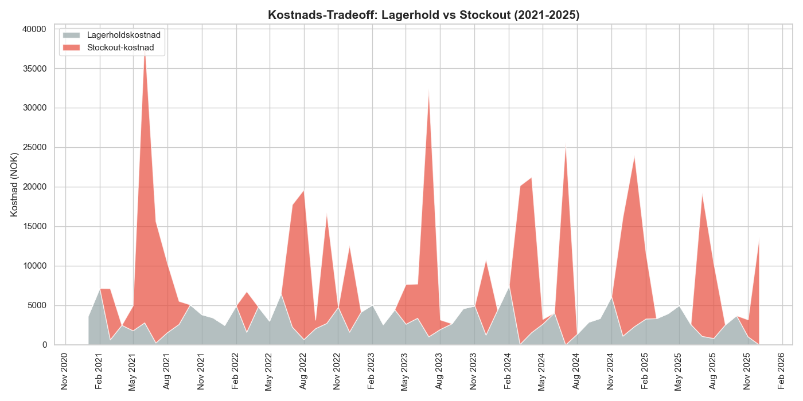
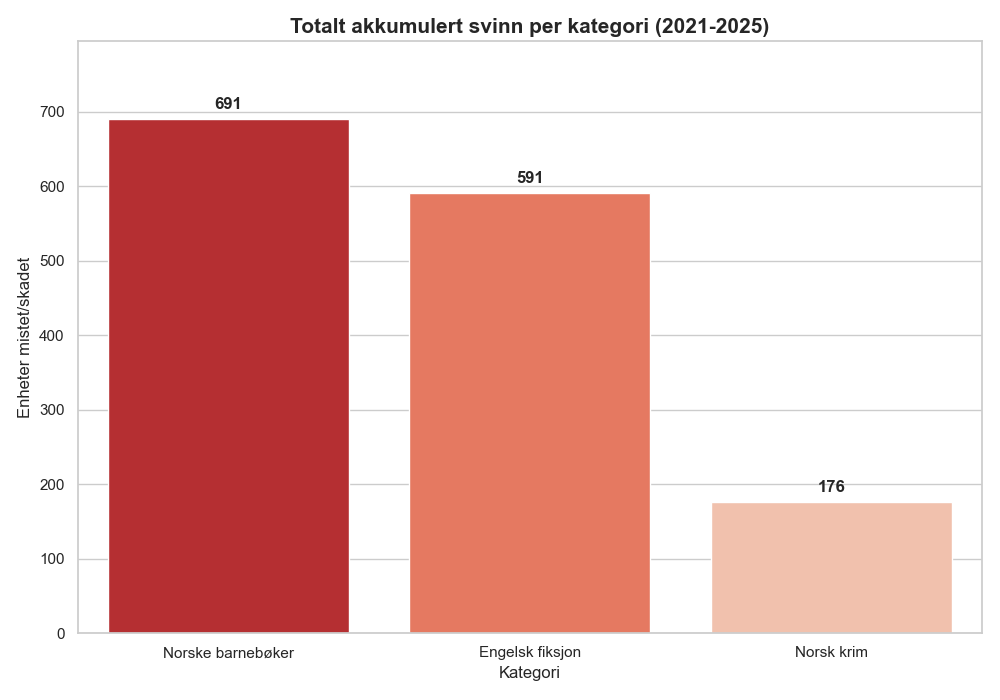
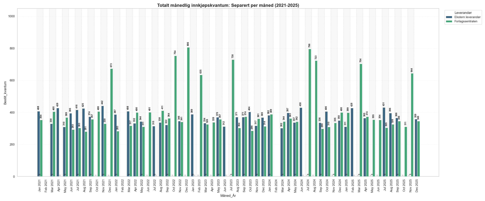
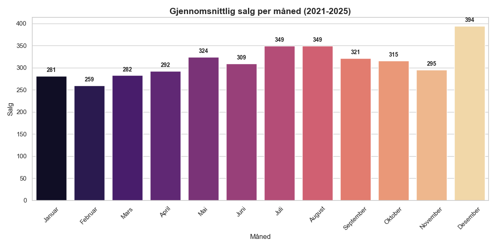
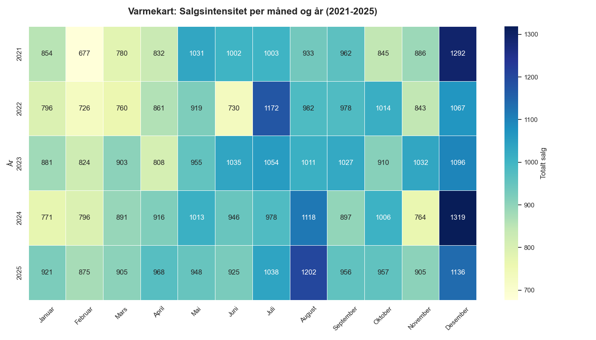

# Datadokumentasjon - Milepæl M4

Dette dokumentet beskriver det vaskede datasettet `master_data_vasket.csv` og de tilhørende visualiseringene som dokumenterer datagrunnlaget for ARK Bokhandel AS.

## 1. Datagrunnlag
Datasettet er basert på simulerte salgsdata for tre hovedkategorier:
- **Norske barnebøker:** Karakterisert av høy frekvens og tydelige sesongsvingninger knyttet til skolestart og jul.
- **Norsk krim:** Viser markante salgstopper i forbindelse med påske ("påskekrim") og sommerferie.
- **Engelsk fiksjon:** Har en mer stabil etterspørsel gjennom året, men påvirkes av internasjonale utgivelsesdatoer og importtider.

## 2. Utførte vaskeoppgaver (Rense og strukturere data)
Prosessen for å klargjøre dataene inkluderte:
- **Sammenslåing:** Kombinert rådata fra flere kilder (Faktadata, Bestillingsdata, Kostnadsparametere).
- **Vask:** Identifisering og retting av inkonsistente datoformater og håndtering av manglende verdier for å sikre tidsrekkeintegritet.
- **Beregning:** Utregning av faktiske lagernivåer basert på inngående beholdning, salg og mottatte bestillinger.
- **Identifisering:** Markering av "stockouts" (perioder der etterspørselen var høyere enn lagerbeholdningen) for å kvantifisere tapt salg.

## 3. Visualisering av datagrunnlag og trender

### 3.1 Lager og etterspørsel
Følgende figurer viser forholdet mellom markedets etterspørsel og faktiske lagernivåer. Dette avdekker kritiske perioder hvor lagerbeholdningen ikke møter behovet.

  
   
  <em>Figur 1: Utvikling i etterspørsel, faktisk salg og lagerbeholdning over tid.</em>

  
   
  <em>Figur 2: Frekvens og varighet av stockouts (utsolgt-situasjoner).</em>

### 3.2 Kategorifordeling og kostnader
Analysen av kategorier viser hvor volumet ligger, mens kostnadsanalysen belyser den økonomiske risikoen ved feil lagerstyring.

  
   
  <em>Figur 3: Fordeling av totalt salgsvolum per produktkategori.</em>

  
   
  <em>Figur 4: Forholdet mellom lagerholdskostnader og mangelkostnader.</em>

  
   
  <em>Figur 5: Oversikt over akkumulert svinn og utgåtte varer.</em>

### 3.3 Sesongmønstre og bestilling
Figurene under dokumenterer hvordan etterspørselen svinger gjennom året, noe som er essensielt for å optimalisere innkjøpsrutiner.

  
   
  <em>Figur 6: Historiske bestillingsmønstre fra leverandører.</em>

  
   
  <em>Figur 8: Gjennomsnittlig salgsvolum per måned som viser sesongtrender.</em>

  
   
  <em>Figur 9: Detaljert analyse av sesongvariasjoner på tvers av kategorier.</em>

## 4. Nøkkelvariable i `master_data_vasket.csv`
- **Dato:** Tidspunkt for observasjon (YYYY-MM-DD).
- **Produktkategori:** Spesifisert som Barnebøker, Krim eller Engelsk fiksjon.
- **Salg:** Antall faktisk solgte enheter (begrenset av `Lagerbeholdning`).
- **Etterspørsel:** Den estimerte underliggende etterspørselen i markedet (brukes for å beregne tapt salg).
- **Lagerbeholdning:** Antall enheter tilgjengelig ved dagens slutt.
- **Kostnadsparametere:** Inkluderer enhetskostnad, lagerholdskostnad (per enhet/dag) og mangelkostnad (per tapte enhet).

## 5. Datakvalitet og analytiske antagelser
For å sikre validiteten i analysen er følgende antagelser lagt til grunn:

1.  **Representativitet:** Det antas at det simulerte datasettet fra ERP-systemet (table.csv) nøyaktig speiler virkelige salgsmønstre for ARK. Eventuelle systemfeil i registrering av returer er antatt å være neglisjerbare.
2.  **Etterspørselens natur:** Der etterspørsel overstiger salg (stockout), antas det at kunden ikke venter på varen (restordre), men at salget går tapt permanent. Dette betyr at mangelkostnaden er direkte proporsjonal med tapt dekningsbidrag.
3.  **Konsistens i kostnader:** Kostnadsparametere (lagerhold og bestilling) antas å være konstante gjennom hele analyseperioden, til tross for potensielle inflasjonsjusteringer eller sesongvariasjoner i fraktpriser.
4.  **Fullstendighet:** Vi antar at alle relevante kampanjeperioder som påvirker etterspørselen er fanget opp i tidsrekkedataene, selv om spesifikke kampanjenavn ikke er eksplisitt kodet.
