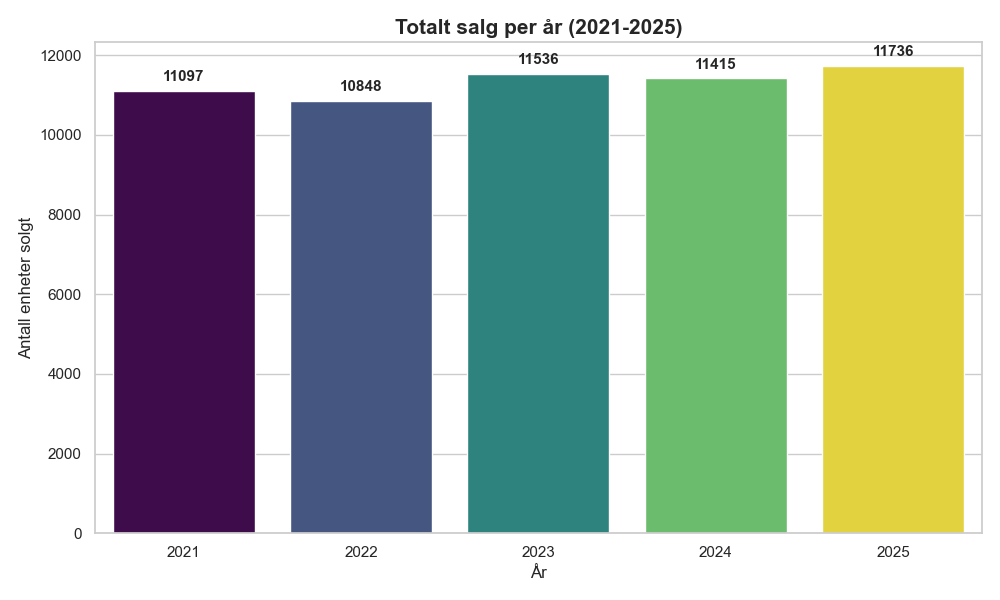

# Datadokumentasjon - Milepæl M4

Dette dokumentet beskriver det vaskede datasettet `master_data_vasket.csv` og de tilhørende visualiseringene som dokumenterer datagrunnlaget for ARK Bokhandel AS.

## 1. Datagrunnlag
Datasettet er basert på simulerte salgsdata for tre hovedkategorier:
- **Norske barnebøker:** Karakterisert av høy frekvens og tydelige sesongsvingninger knyttet til skolestart og jul.
- **Norsk krim:** Viser markante salgstopper i forbindelse med påske ("påskekrim") og sommerferie.
- **Engelsk fiksjon:** Har en mer stabil etterspørsel gjennom året, men påvirkes av internasjonale utgivelsesdatoer og importtider.

## 2. Utførte vaskeoppgaver (Rense og strukturere data)
Prosessen for å klargjøre dataene inkluderte:
- **Sammenslåing:** Kombinert rådata fra flere kilder (Faktadata, Bestillingsdata, Kostnadsparametere).
- **Vask:** Identifisering og retting av inkonsistente datoformater og håndtering av manglende verdier for å sikre tidsrekkeintegritet.
- **Beregning:** Utregning av faktiske lagernivåer basert på inngående beholdning, salg og mottatte bestillinger.
- **Identifisering:** Markering av "stockouts" (perioder der etterspørselen var høyere enn lagerbeholdningen) for å kvantifisere tapt salg.

## 3. Visualisering av datagrunnlag og trender

### 3.1 Lager og etterspørsel
Følgende figurer viser forholdet mellom markedets etterspørsel og faktiske lagernivåer. Dette avdekker kritiske perioder hvor lagerbeholdningen ikke møter behovet.

  
   
  <em>Figur 1: Utvikling i etterspørsel, faktisk salg og lagerbeholdning over tid.</em>

*Funn:* Etterspørselen (blå) ligger systematisk over faktisk salg (grønn) i perioder der lagerbeholdningen (grått areal) nærmer seg null. Dette bekrefter at gapet mellom kurvene utgjør tapt salg, ikke redusert markedsbehov, og motiverer bruken av etterspørsel (ikke salg) som målvariabel i prognosemodellen.

  
   
  <em>Figur 2: Frekvens og varighet av stockouts (utsolgt-situasjoner).</em>

*Funn:* Engelsk fiksjon har flest og største restordre-hendelser (topp 299 enheter i juni 2021), mens Norsk krim domineres av sommertopper knyttet til påskekrim og ferielesing. Norske barnebøker viser konsentrerte stockouts rundt skolestart (august) og jul. Mønsteret understøtter behovet for kategori-spesifikk sikkerhetslager.

### 3.2 Kategorifordeling og kostnader
Analysen av kategorier viser hvor volumet ligger, mens kostnadsanalysen belyser den økonomiske risikoen ved feil lagerstyring.

  
   
  <em>Figur 3: Fordeling av totalt salgsvolum per produktkategori.</em>

*Funn:* Norsk krim står for 37,3 % av totalvolumet, Engelsk fiksjon 33,9 % og Norske barnebøker 28,8 %. Fordelingen er relativt jevn, noe som gjør at alle tre kategorier er analytisk relevante og bør modelleres individuelt.

  
   
  <em>Figur 4: Forholdet mellom lagerholdskostnader og mangelkostnader.</em>

*Funn:* Stockout-kostnader (røde topper) overgår lagerholdskostnader (grått) med en faktor på 4–7 i toppmåneder, mens lagerholdskostnaden er relativt konstant rundt 3 000–5 000 NOK/måned. Asymmetrien bekrefter den økonomiske gevinsten ved å redusere stockouts gjennom bedre prognoser og bestillingsregler.

  
   
  <em>Figur 5: Oversikt over akkumulert svinn og utgåtte varer.</em>

*Funn:* Norske barnebøker (691 enheter) og Engelsk fiksjon (591 enheter) står for det meste av svinnet, mens Norsk krim har kun 176 enheter. Dette reflekterer at kategorier med lavere omløpshastighet er mer utsatt for skadet/utgått vare og bør vurderes ved dimensjonering av bestillingsmengde.

### 3.3 Sesongmønstre og bestilling
Figurene under dokumenterer hvordan etterspørselen svinger gjennom året, noe som er essensielt for å optimalisere innkjøpsrutiner.

  
   
  <em>Figur 6: Historiske bestillingsmønstre fra leverandører.</em>

*Funn:* Ekstern leverandør brukes jevnlig med relativt stabile kvanta (300–430 enheter), mens Forlagssentralen har færre, men markant større bestillinger (opptil 806 enheter), typisk før jul og sommer. Dette illustrerer de to underliggende ledetids- og kostnadsregimene som bestillingsmodellen må håndtere.

  
   
  <em>Figur 7: Totalt årlig salg 2021–2025.</em>

*Funn:* Årlig totalsalg ligger stabilt mellom 10 848 (2022) og 11 736 enheter (2025), med en svak positiv trend. Dette indikerer et modent marked uten strukturelle volumendringer i analyseperioden, noe som støtter antagelsen om at historiske sesongmønstre er representative for fremtidig etterspørsel.

  
   
  <em>Figur 8: Gjennomsnittlig salgsvolum per måned som viser sesongtrender.</em>

*Funn:* Desember (394 enheter) og juli/august (349) er de klart sterkeste månedene, mens februar (259) er svakest. Forskjellen mellom topp og bunn er ca. 52 %, noe som kvantifiserer viktigheten av å inkludere eksplisitte sesongkomponenter i prognosemodellen.

  
   
  <em>Figur 9: Detaljert analyse av sesongvariasjoner på tvers av kategorier.</em>

*Funn:* Varmekartet viser at desember er den sterkeste måneden hvert år (1 067–1 319 enheter) og at sesongmønsteret er stabilt på tvers av 2021–2025. Få avvikende celler indikerer at sesongprofilen ikke har endret seg vesentlig over tid, noe som styrker Prophet-modellens evne til å generalisere på testperioden.

## 4. Nøkkelvariable i `master_data_vasket.csv`
- **Dato:** Tidspunkt for observasjon (YYYY-MM-DD).
- **Produktkategori:** Spesifisert som Barnebøker, Krim eller Engelsk fiksjon.
- **Salg:** Antall faktisk solgte enheter (begrenset av `Lagerbeholdning`).
- **Etterspørsel:** Den estimerte underliggende etterspørselen i markedet (brukes for å beregne tapt salg).
- **Lagerbeholdning:** Antall enheter tilgjengelig ved dagens slutt.
- **Kostnadsparametere:** Inkluderer enhetskostnad, lagerholdskostnad (per enhet/dag) og mangelkostnad (per tapte enhet).

## 5. Datakvalitet og analytiske antagelser
For å sikre validiteten i analysen er følgende antagelser lagt til grunn. Hver antagelse er koblet til sin konkrete konsekvens for analysens pålitelighet:

1.  **Representativitet:** Det simulerte datasettet fra ERP-systemet (table.csv) antas å speile virkelige salgsmønstre for ARK, og eventuelle systemfeil i registrering av returer antas neglisjerbare.
    *   *Konsekvens:* Resultatene må tolkes som beslutningsstøtte for ARK-lignende bokhandelsporteføljer, ikke som absolutte prognoser. Validering mot reelle ERP-data bør gjøres før produksjonssetting.
2.  **Etterspørselens natur:** Der etterspørsel overstiger salg (stockout), antas kunden å ikke vente på varen — salget går tapt permanent (lost sales, ikke backorder).
    *   *Konsekvens:* Mangelkostnaden settes lik tapt dekningsbidrag uten goodwill-komponent. Dersom kunder faktisk venter, vil modellen overestimere mangelkostnaden og dermed sikkerhetslageret.
3.  **Konsistens i kostnader:** Lagerholds- og bestillingskostnadene antas konstante gjennom hele analyseperioden (2021–2025), til tross for inflasjon og mulige sesongvariasjoner i fraktpriser.
    *   *Konsekvens:* Kostnadsnivåene i den kvantitative bestillingsmodellen er indikative og ikke justert for prisstigning. Sensitivitetsanalysen (aktivitet 3.12) tester robustheten mot ±20 % kostnadsendring.
4.  **Fullstendighet i kampanjeeffekter:** Alle relevante kampanjeperioder antas fanget opp i tidsrekkedataene, selv om spesifikke kampanjenavn ikke er eksplisitt kodet i rådataene.
    *   *Konsekvens:* Kampanjeidentifisering skjer retrospektivt via Z-score residualanalyse (aktivitet 3.8). Dersom en kampanje har lavt avvik (< 1,5 σ), vil den feilaktig tolkes som ordinær sesongvariasjon og gi en systematisk overestimering i tilsvarende uke året etter.
