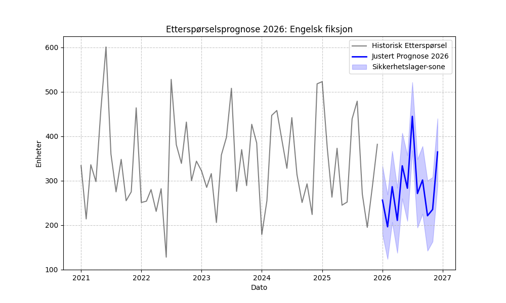
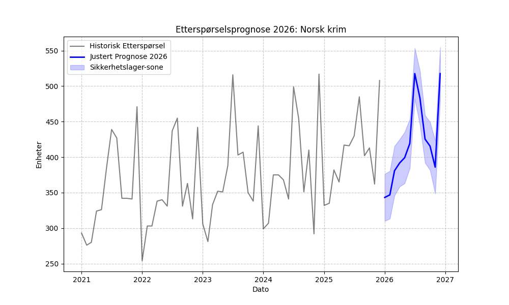
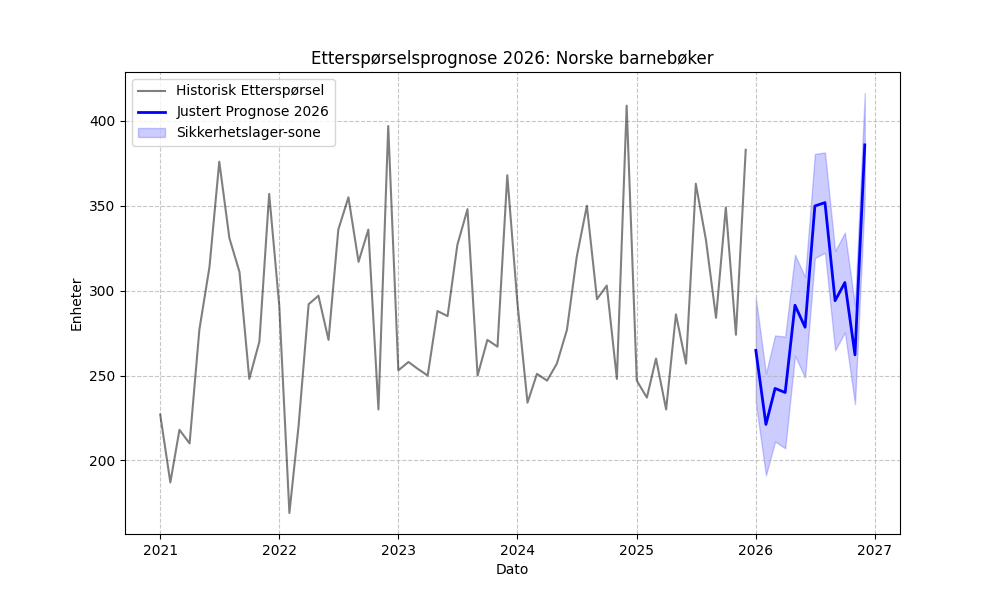

# Rapport: 3.11 Prognosegenerering 2026

Dette dokumentet presenterer de endelige etterspørselsprognosene for 2026, basert på optimaliserte bestillingsregler.

## Metodikk
1. **Full historikk:** Modellen er trent på alle tilgjengelige data fra 2021 til desember 2025.
2. **Bias-justering:** Prognosene er korrigert for systematiske skjevheter identifisert i backtestingen (steg 3.9).
3. **Sikkerhetslager:** Dynamisk beregning av sikkerhetslager basert på modellens usikkerhetsintervall og de optimaliserte k-faktorene fra steg 3.10.

## Prognoseoversikt 2026 (Snitt per måned)

| Kategori          |   yhat_adj |   Safety_Stock |   Order_Up_To |
|:------------------|-----------:|---------------:|--------------:|
| Engelsk fiksjon   |     283.82 |          75.6  |        359.42 |
| Norsk krim        |     418.9  |          35.1  |        454    |
| Norske barnebøker |     290.59 |          30.26 |        320.85 |

## Visualiseringer

  
   
  <em>Figur: Prognose og sikkerhetslager for Engelsk fiksjon i 2026</em>

  
   
  <em>Figur: Prognose og sikkerhetslager for Norsk krim i 2026</em>

  
   
  <em>Figur: Prognose og sikkerhetslager for Norske barnebøker i 2026</em>

