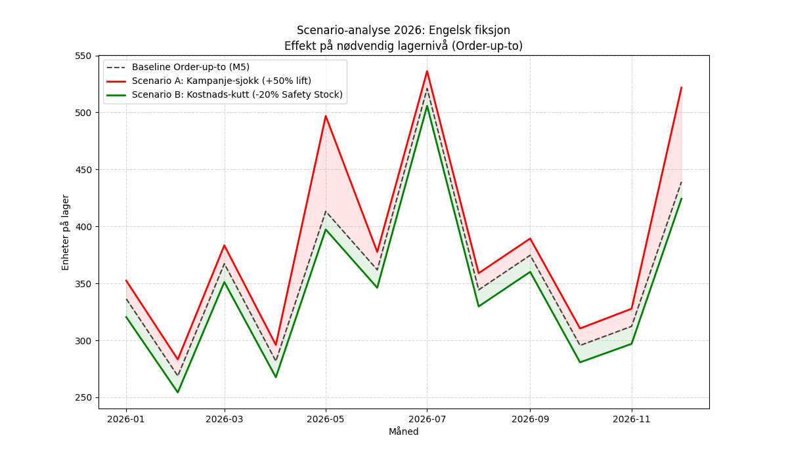
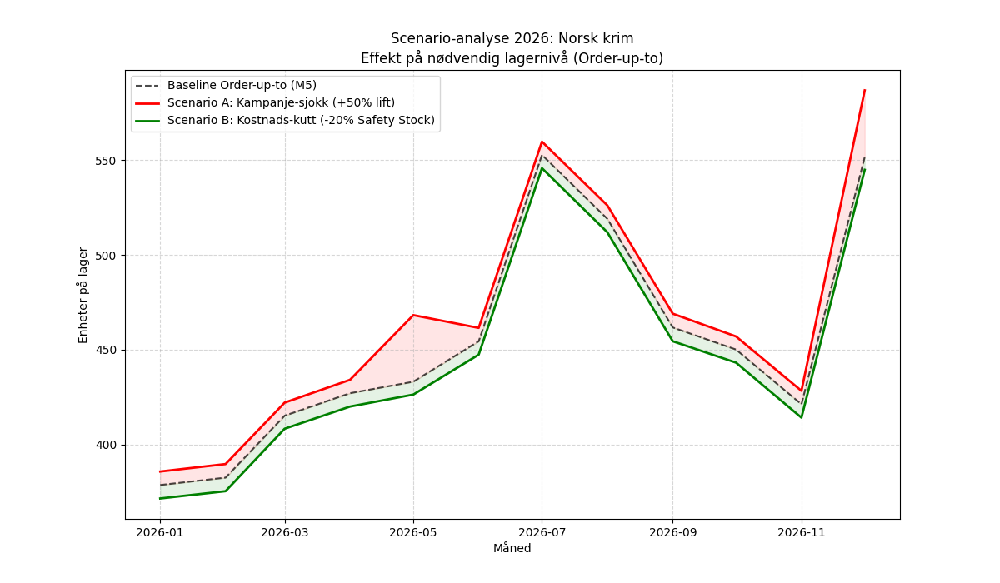
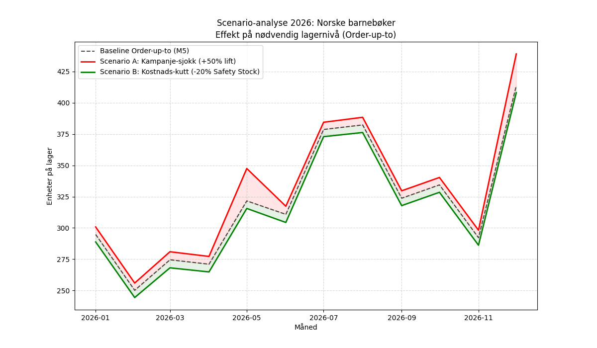

# Rapport: 3.12 Scenario-analyse 2026

Dette dokumentet analyserer hvordan eksterne endringer i 2026 vil påvirke lagerbehovet.

## Antagelser og datakvalitet
- **Sykronisering:** Modellen antar at sesongmønsteret fra de siste 4 årene vil vedvare i 2026.
- **Kampanjeløft:** Kampanjeløftet i scenario A er basert på historisk effekt pluss et estimert sjokk (50% økning av gjennomsnittlig løft).
- **Prognosekvalitet:** Analysen tar høyde for volatilitet (sikkerhetslager), men ekstreme uforutsette hendelser (f.eks. ny pandemi) er ikke inkludert.

## Scenariebeskrivelser
1. **Baseline:** Basert på optimaliserte parametere fra Aktivitet 3.10.
2. **Scenario A (Kampanje-sjokk):** Simulerer en situasjon der kampanjene i mai og desember gir 50% høyere løft enn historisk snitt. Vi øker også sikkerhetslageret med 20% for å håndtere økt volatilitet.
3. **Scenario B (Kostnads-sjokk):** Simulerer en 30% økning i lagerkostnader, som tvinger oss til å redusere sikkerhetslageret med 20% for å minimere kapitalbinding.

## Resultat-oppsummering (Gjennomsnittlig lagernivå 2026)

| Kategori          |   Baseline (Units) |   Kampanje-sjokk (Units) |   Kostnads-sjokk (Units) |
|:------------------|-------------------:|-------------------------:|-------------------------:|
| Engelsk fiksjon   |              359.7 |                    386.2 |                    344.5 |
| Norsk krim        |              454   |                    465.7 |                    446.9 |
| Norske barnebøker |              320.7 |                    330   |                    314.6 |

## Prosentvis endring vs Baseline

| Kategori          |   Baseline (Units) |   Kampanje-sjokk (Units) |   Kostnads-sjokk (Units) |
|:------------------|-------------------:|-------------------------:|-------------------------:|
| Engelsk fiksjon   |                  0 |                      7.4 |                     -4.2 |
| Norsk krim        |                  0 |                      2.6 |                     -1.6 |
| Norske barnebøker |                  0 |                      2.9 |                     -1.9 |

## Visualiseringer

  
   
  <em>Figur 1: Scenario-sammenligning for Engelsk fiksjon i 2026</em>

  
   
  <em>Figur 2: Scenario-sammenligning for Norsk krim i 2026</em>

  
   
  <em>Figur 3: Scenario-sammenligning for Norske barnebøker i 2026</em>

