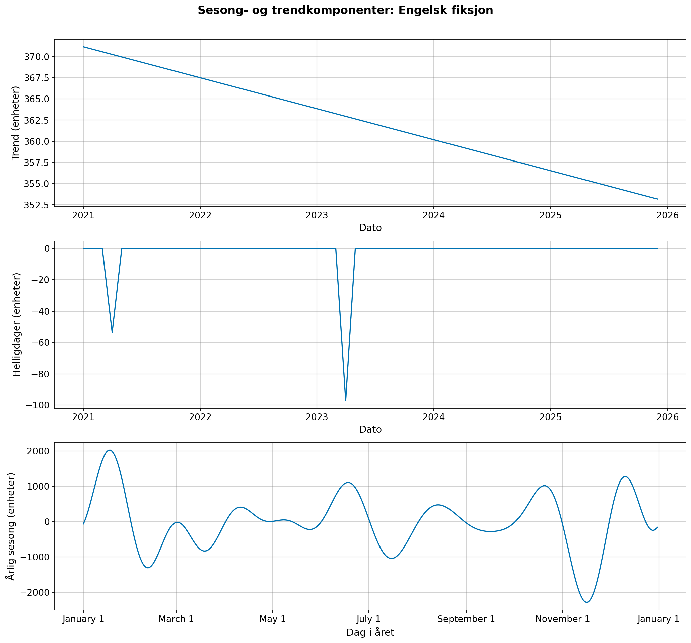
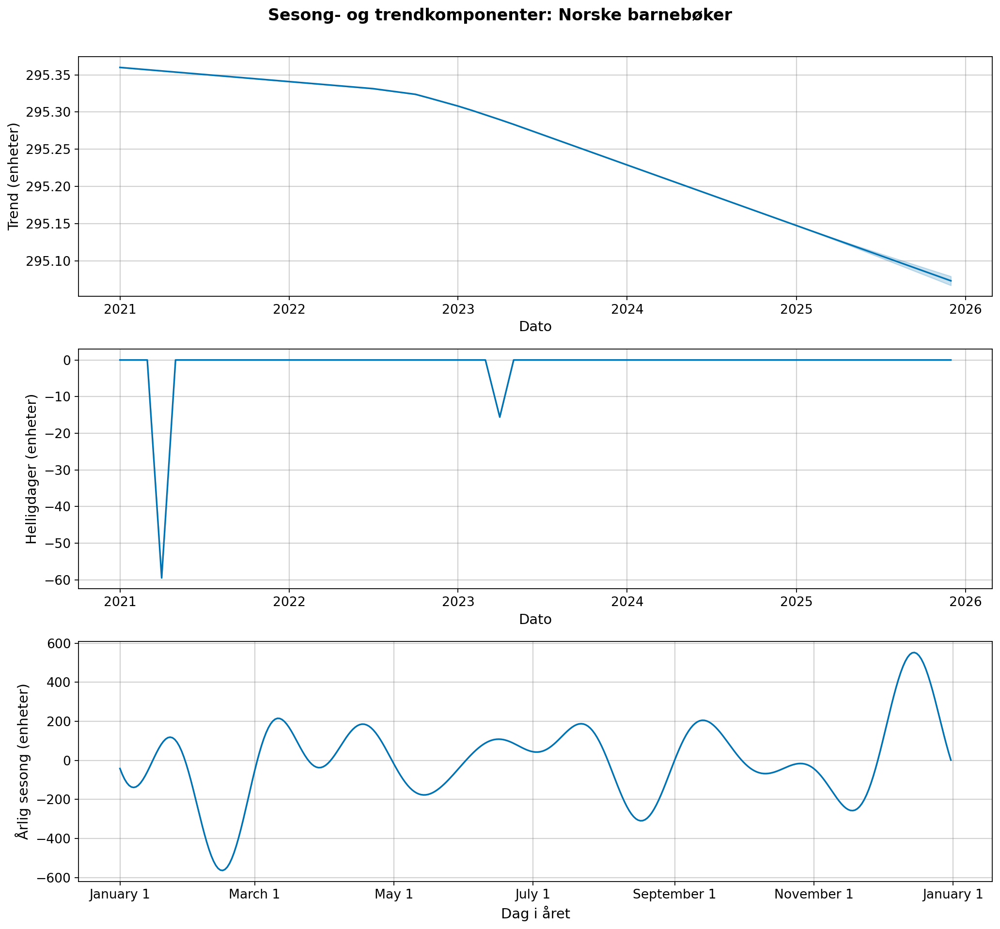
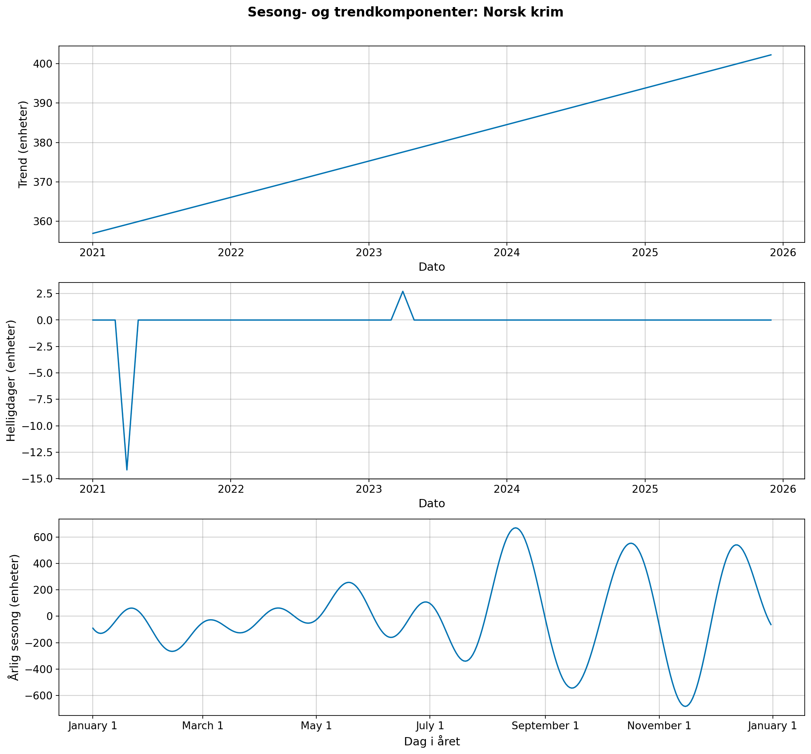

# Resultater - Kvantitativ modell (Aktivitet 3.5)

Dette dokumentet beskriver den opprinnelige Prophet-implementasjonen fra aktivitet 3.5 under Milepæl M5. Modellen danner grunnlaget for de dynamiske bestillingsreglene som senere videreutvikles med kampanjedeteksjon (3.8), backtesting (3.9) og optimaliserte bestillingsregler (3.10).

## 1. Metodikk
Prophet-modellen (Taylor & Letham, 2018) er trent separat for hver av de tre kategoriene på treningsdatasettet `004 data/splittet_data/train/train_data.csv` (2021–2024). Implementasjonen finnes i `004 data/python_skript/prophet_analysis.py` og konfigurerer modellen slik:

- **Sesongvariasjon:** Årlig sesong aktivert (`yearly_seasonality=True`), ukentlig og daglig deaktivert.
- **Helligdager:** Eksplisitte `jul` (15 dager før julaften), `påske` (10 dager før) og `skolestart` (±7 dager) er lagt inn som `holidays`-DataFrame.
- **Respons:** Modellen trenes på kolonnen `Etterspørsel`, ikke `Salg`, slik at historiske lagerbegrensninger (stockouts) ikke skjuler det reelle behovet.
- **Prognosehorisont:** 12 måneder fremover (månedlig frekvens), som benyttes som input til bestillingsmodellen i kapittel 6.3 i `rapport.md`.

## 2. Estimerte nøkkelparametere
Modellen dekomponerer tidsserien i trend $g(t)$, sesong $s(t)$, helligdager $h(t)$ og feilledd $\epsilon_t$. Tabellen under oppsummerer trendendring over hele analyseperioden (2021–2026) og maksimal sesongamplitude per kategori:

| Kategori          | Trend-endring (%) | Sesong-amplitude (enheter) |
|:------------------|------------------:|---------------------------:|
| Engelsk fiksjon   |            -4,84  |                      204,8 |
| Norske barnebøker |            -0,10  |                      105,3 |
| Norsk krim        |           +12,70  |                      114,8 |

**Observasjoner:**
- *Norsk krim* har den tydeligste positive trenden, noe som underbygger at baseline-modellen i 3.4 systematisk underdimensjonerer volumet for denne kategorien.
- *Engelsk fiksjon* har høyest sesongamplitude (ca. 205 enheter), i tråd med de observerte sommer- og juletoppene i kapittel 7 i `rapport.md`.
- *Norske barnebøker* har en svært flat trend (-0,10 %), som bekrefter at kategorien er moden med forutsigbart årlig volum.

## 3. Visualisering av komponentene
Figurene under viser Prophet-dekomponeringen før utvidet feature engineering (aktivitet 3.8). De illustrerer at trend, helligdagseffekter og årlig sesong allerede i basiskonfigurasjonen fanger opp de dominerende mønstrene, men at kampanjesjokk ennå ikke er isolert fra sesongkomponenten.

  
   
  <em>Figur 1: Prophet-komponenter for Engelsk fiksjon (trend, helligdager og årlig sesongvariasjon).</em>

  
   
  <em>Figur 2: Prophet-komponenter for Norske barnebøker. Tydelige topper i helligdagskomponenten ved skolestart og jul.</em>

  
   
  <em>Figur 3: Prophet-komponenter for Norsk krim. Positiv trend og kraftige sommer-/helligdagseffekter er synlige.</em>

## 4. Kobling mot øvrige aktiviteter
- **3.4 Baseline-løsning:** Trenden og sesongamplituden i tabellen over forklarer hvorfor (s, Q)-baselinen spesielt underpresterer for *Norsk krim* (positiv trend) og *Engelsk fiksjon* (stor sesongamplitude).
- **3.6 Analysepakke:** Prognosene fra denne modellen kombineres med sikkerhetslager og kostnadsparametere i simuleringen, og er grunnlaget for `M5_Sluttresultater_Simulering.md`.
- **3.7 Sensitivitetsanalyse:** Resultatene her benyttes til å vurdere robusthet mot variasjoner i $C_s$, $C_h$ og sikkerhetsmargin.
- **3.8 Utvidet feature engineering:** Basisfiguren som vises som *Figur 12* i `rapport.md` kapittel 6.1.5 er hentet herfra og brukes for å illustrere forskjellen før/etter kampanjedeteksjon.

## 5. Antagelser for modellen
Følgende forutsetninger ligger til grunn for denne basisversjonen (se også kapittel 6.4 i `rapport.md`):
1. **Additiv dekomponering:** Trend, sesong og helligdager antas å påvirke etterspørselen additivt.
2. **Stasjonær reststøy:** Feilleddet $\epsilon_t$ antas normalfordelt med forventning null, noe som senere benyttes ved beregning av sikkerhetslager.
3. **Deterministisk kalender:** Helligdagsvinduene (jul, påske, skolestart) er låst til faste dager per år, og eventuell variasjon i varighet fanges ikke opp.
4. **Ingen kampanjer i basisversjonen:** Enkeltstående salgstopper som faktisk skyldes markedsføring er ikke skilt ut her; dette adresseres i aktivitet 3.8 via Z-score-analyse.

---
*Dokumentet er opprettet 2026-04-20 som del av ferdigstillelsen av aktivitet 3.5. Figurene er generert av `004 data/python_skript/prophet_analysis.py`.*
