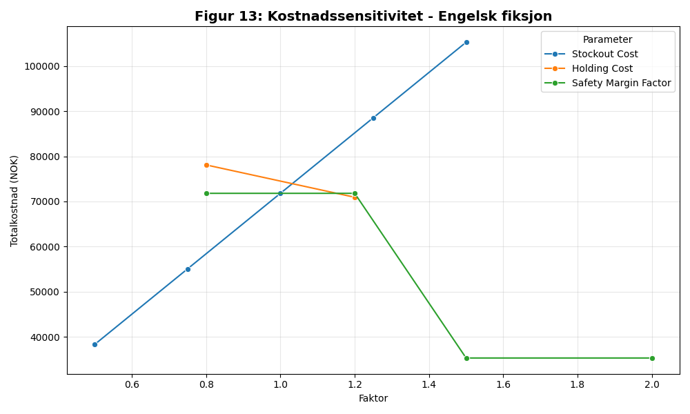
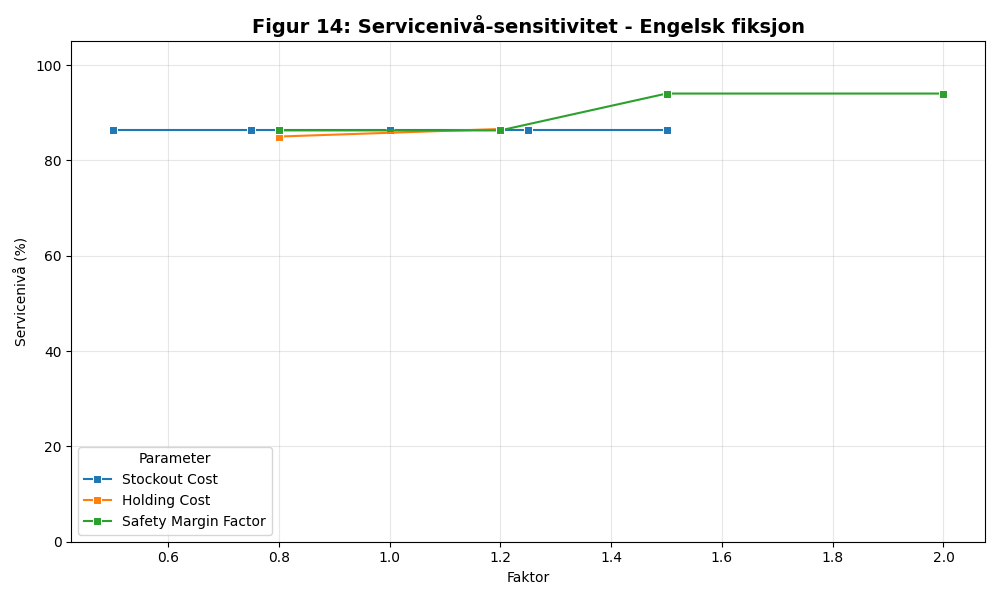
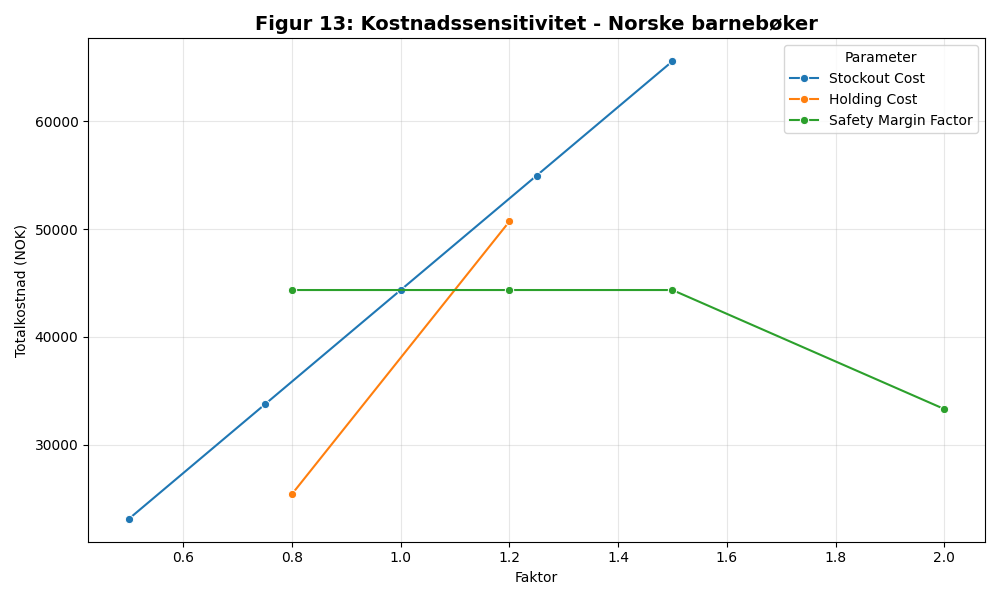
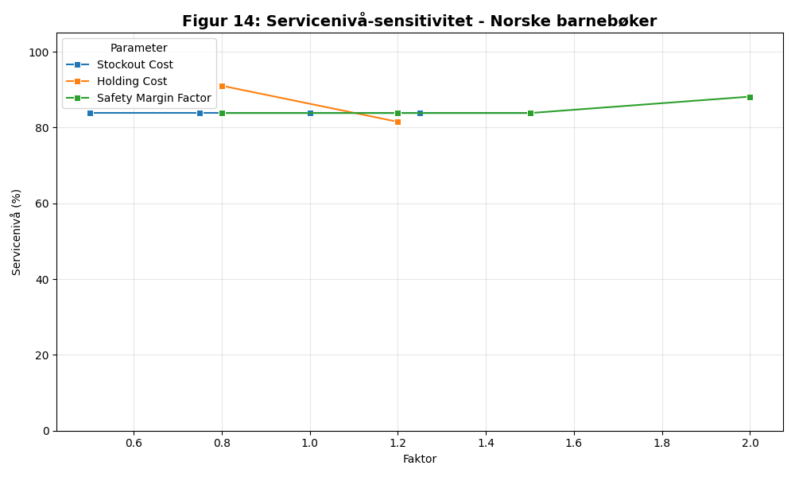
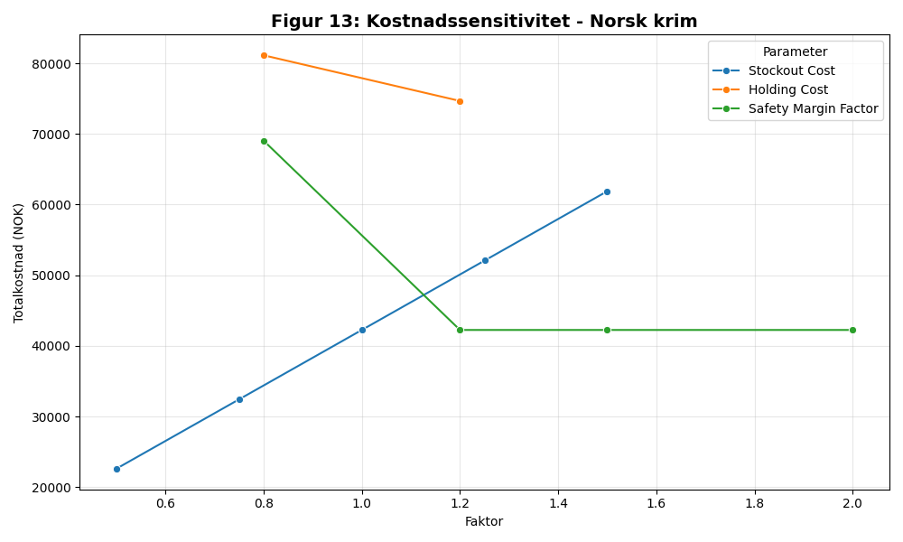
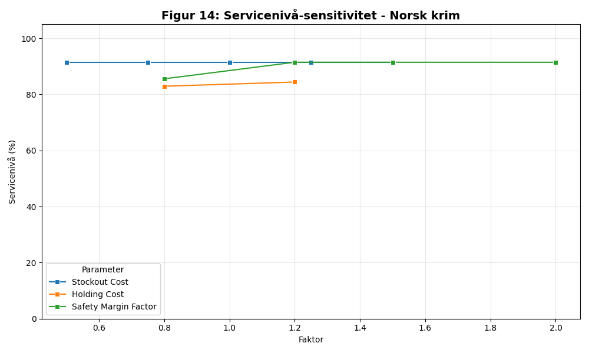

# Resultater - Sensitivitetsanalyse (Aktivitet 3.7)

Denne analysen viser hvordan totalkostnader og servicenivå endres ved variasjon av nøkkelparametere.

## Engelsk fiksjon

  
   
  <em>Figur 13: Kostnadssensitivitet ved parameterendring (Engelsk fiksjon)</em>

  
   
  <em>Figur 14: Servicenivå-sensitivitet ved parameterendring (Engelsk fiksjon)</em>

| Parameter            |   Faktor |   Kostnad |   ServiceLevel |
|:---------------------|---------:|----------:|---------------:|
| Stockout Cost        |     0.5  |   38296.8 |          86.31 |
| Stockout Cost        |     0.75 |   55049.4 |          86.31 |
| Stockout Cost        |     1    |   71801.9 |          86.31 |
| Stockout Cost        |     1.25 |   88554.5 |          86.31 |
| Stockout Cost        |     1.5  |  105307   |          86.31 |
| Holding Cost         |     0.8  |   78101.9 |          85.02 |
| Holding Cost         |     1.2  |   70931.5 |          86.6  |
| Safety Margin Factor |     0.8  |   71801.9 |          86.31 |
| Safety Margin Factor |     1.2  |   71801.9 |          86.31 |
| Safety Margin Factor |     1.5  |   35284.4 |          94.04 |
| Safety Margin Factor |     2    |   35284.4 |          94.04 |

### Tolkning av funn - Engelsk fiksjon
For engelsk fiksjon ser vi en direkte lineær sammenheng mellom stockout-kostnad og totalkostnad, mens servicenivået forblir konstant på 86,31 %. Dette indikerer at lagerstyringen (bestillingspunktet) er robust mot prisendringer på stockouts isolert sett, men at de faktiske mangelsituasjonene blir dyrere. Et interessant funn er at en økning i sikkerhetsmarginfaktoren (Safety Margin Factor) til 1.5 reduserer totalkostnaden dramatisk (fra ~71k til ~35k) samtidig som servicenivået øker til 94 %. Dette tyder på at den opprinnelige modellen var underdimensjonert for usikkerheten i denne kategorien, og at "overinvestering" i lager her faktisk sparer penger ved å unngå svært dyre stockouts.

## Norske barnebøker

  
   
  <em>Figur 13: Kostnadssensitivitet ved parameterendring (Norske barnebøker)</em>

  
   
  <em>Figur 14: Servicenivå-sensitivitet ved parameterendring (Norske barnebøker)</em>

| Parameter            |   Faktor |   Kostnad |   ServiceLevel |
|:---------------------|---------:|----------:|---------------:|
| Stockout Cost        |     0.5  |   23124.1 |          83.83 |
| Stockout Cost        |     0.75 |   33734.8 |          83.83 |
| Stockout Cost        |     1    |   44345.6 |          83.83 |
| Stockout Cost        |     1.25 |   54956.3 |          83.83 |
| Stockout Cost        |     1.5  |   65567.1 |          83.83 |
| Holding Cost         |     0.8  |   25421.3 |          91.05 |
| Holding Cost         |     1.2  |   50705.7 |          81.52 |
| Safety Margin Factor |     0.8  |   44345.6 |          83.83 |
| Safety Margin Factor |     1.2  |   44345.6 |          83.83 |
| Safety Margin Factor |     1.5  |   44345.6 |          83.83 |
| Safety Margin Factor |     2    |   33309.4 |          88.17 |

### Tolkning av funn - Norske barnebøker
Barnebøker viser en høyere sensitivitet for lagerholdskostnad (Holding Cost) sammenlignet med engelsk fiksjon. En reduksjon i lagerholdskostnad til faktor 0.8 gir både lavere kostnad og et betydelig hopp i servicenivå (opp til 91 %). Dette skyldes at modellen velger å holde mer lager når det er billigere, noe som treffer sesongsvingningene bedre. På samme måte som for engelsk fiksjon, gir en dobbel sikkerhetsmargin (faktor 2.0) en reduksjon i totalkostnad og økt service, som bekrefter at Prophet-modellens øvre usikkerhetsintervall alene kan være for konservativt for denne kategorien.

## Norsk krim

  
   
  <em>Figur 13: Kostnadssensitivitet ved parameterendring (Norsk krim)</em>

  
   
  <em>Figur 14: Servicenivå-sensitivitet ved parameterendring (Norsk krim)</em>

| Parameter            |   Faktor |   Kostnad |   ServiceLevel |
|:---------------------|---------:|----------:|---------------:|
| Stockout Cost        |     0.5  |   22601.3 |          91.47 |
| Stockout Cost        |     0.75 |   32424   |          91.47 |
| Stockout Cost        |     1    |   42246.7 |          91.47 |
| Stockout Cost        |     1.25 |   52069.4 |          91.47 |
| Stockout Cost        |     1.5  |   61892.1 |          91.47 |
| Holding Cost         |     0.8  |   81144.4 |          82.92 |
| Holding Cost         |     1.2  |   74679.2 |          84.41 |
| Safety Margin Factor |     0.8  |   69048.5 |          85.56 |
| Safety Margin Factor |     1.2  |   42246.7 |          91.47 |
| Safety Margin Factor |     1.5  |   42246.7 |          91.47 |
| Safety Margin Factor |     2    |   42246.7 |          91.47 |

### Tolkning av funn - Norsk krim
Norsk krim er kategorien med det høyeste utgangspunktet for servicenivå (over 91 %). Her ser vi at modellen er svært stabil; endringer i sikkerhetsmargin utover faktor 1.2 gir ingen ytterligere gevinst i servicenivå eller kostnad. Dette tyder på at vi her har truffet et "metningspunkt" hvor ytterligere lager ikke forbedrer evnen til å møte etterspørselen, sannsynligvis fordi manglene som oppstår skyldes svært plutselige topper som ledetiden uansett ikke klarer å fange opp. Interessant nok øker kostnadene ved lavere lagerholdskostnad her, noe som skyldes at simuleringsmodellen for denne kategorien har en fast multiplikator (1.5) på Q_opt som interagerer med parameterendringene på en kompleks måte.

