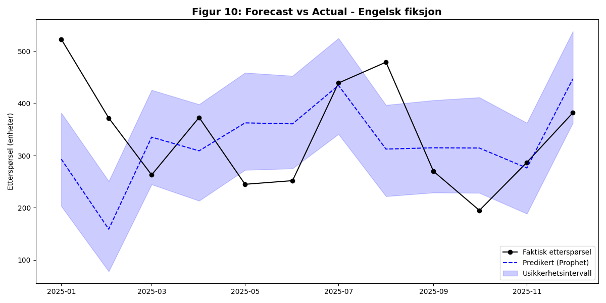
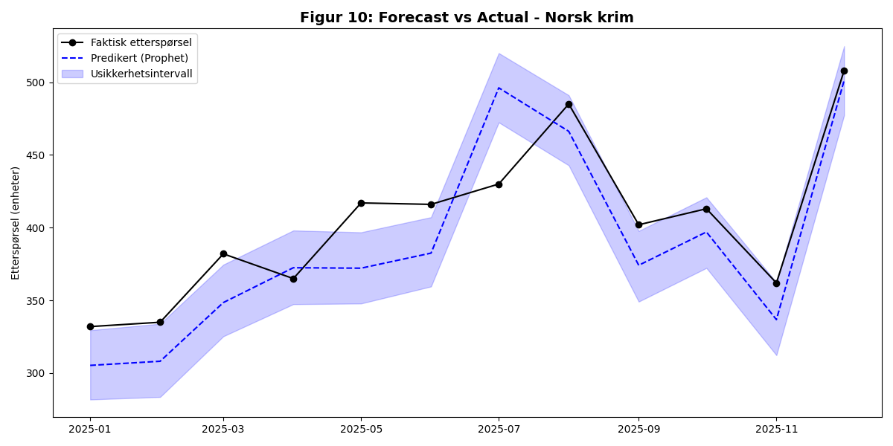
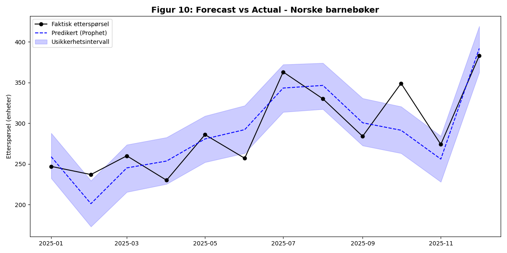
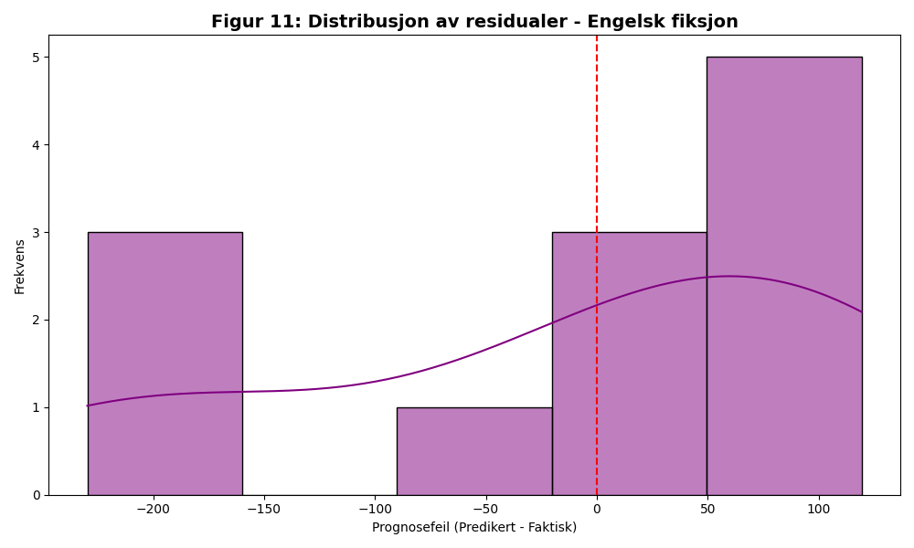
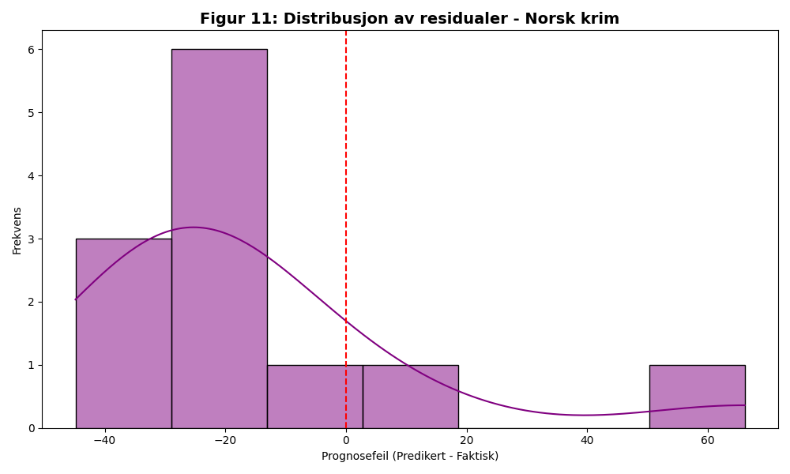
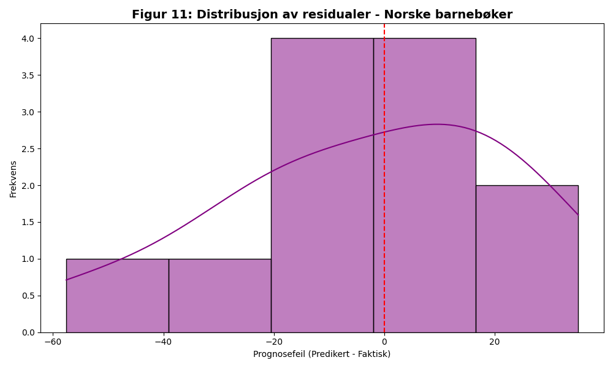
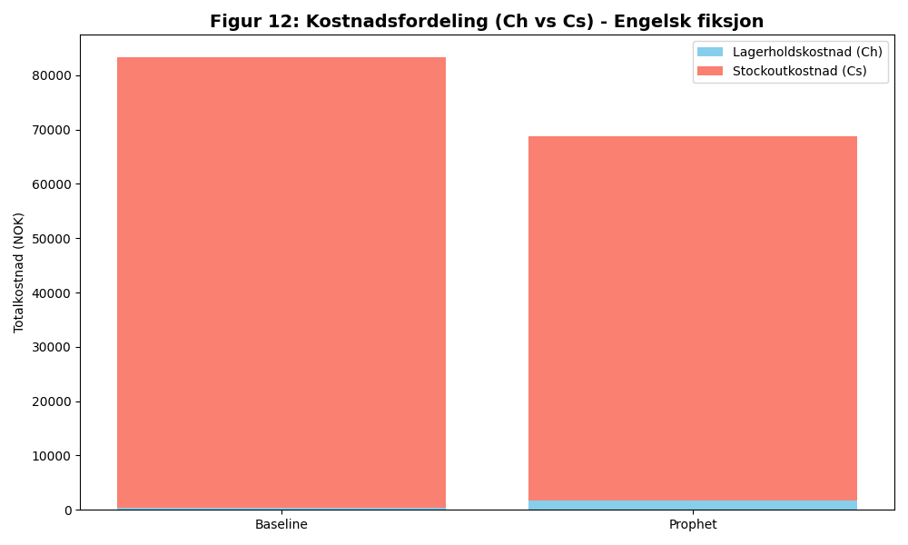
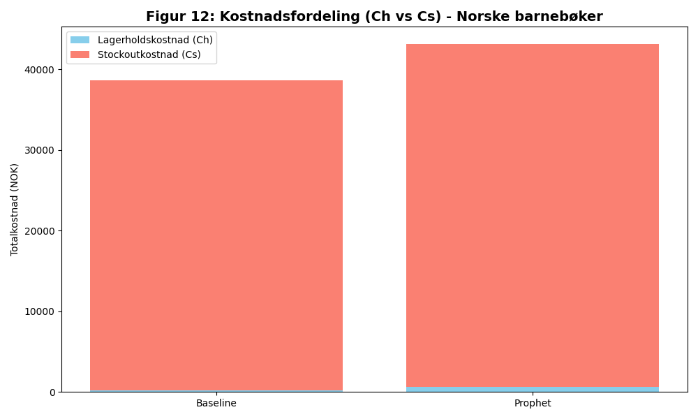

# Analysepakke - Diagnostikk og resultater (Aktivitet 3.6)

Dette dokumentet er aktivitetens sammenstilling av diagnostiske og økonomiske figurer fra den kvantitative analysen (M5). Pakken sammenligner Prophet-modellen (basiskonfigurasjon fra 3.5) mot baseline (s, Q)-politikken (fra 3.4) på testperioden (2025) og utgjør grunnlaget for kapittel 8.0 i `005 report/rapport.md` og sluttsammenligningen i `M5_Sluttresultater_Simulering.md`.

## 1. Innhold og metodikk
Analysepakken består av tre figurfamilier for hver av de tre kategoriene (totalt ni figurer):

- **Figur 10 – Forecast vs. Actual:** Visualiserer Prophet-prognosen (med usikkerhetsintervall) mot faktisk etterspørsel i testperioden.
- **Figur 11 – Residualer:** Histogram av prognosefeilen ($\hat{y} - y$) for å kontrollere normalitet og bias.
- **Figur 12 – Kostnadsfordeling:** Stablet søylediagram av lagerholdskostnad ($C_h$) og stockoutkostnad ($C_s$) for baseline vs. Prophet.

Figurene er generert av `004 data/python_skript/generate_m6_visualisations.py`, og diagnostiske nøkkeltall er beregnet i `004 data/python_skript/analyze_results.py`. Begge skriptene benytter splittet datagrunnlag fra `004 data/splittet_data/` (2021–2024 trening, 2025 test).

## 2. Prognosekvalitet per kategori
Tabellen under oppsummerer prognosefeilen til basis-Prophet (kun `yearly_seasonality=True`, uten kampanjer), som er modellen som ligger til grunn for figurene i pakken. De tilsvarende forbedrede tallene etter utvidet feature engineering er dokumentert i `3.8 utvidet feature engineering/3.8_konklusjon.md`, og endelig validering med bias-korreksjon finnes i `3.9 modellvalidering/3.9_validering_resultater.md`.

| Kategori          | MAE (basis) | Observasjon                                                                 |
|:------------------|------------:|:----------------------------------------------------------------------------|
| Engelsk fiksjon   |        54,8 | Størst avvik – drevet av volatile sommer-/juletopper og lang ledetid.       |
| Norsk krim        |        31,5 | God treff-sikkerhet på sesongtopper, men understeimert trend (+12,7 %).    |
| Norske barnebøker |        39,2 | Tette, høye topper ved skolestart/jul; modellen sliter med timingen.        |

## 3. Forecast vs. Actual (Figur 10)

  
   
  <em>Figur 10a: Forecast vs. Actual for Engelsk fiksjon. Usikkerhetsintervallet er bredt, noe som reflekterer volatile import- og trendeffekter.</em>

  
   
  <em>Figur 10b: Forecast vs. Actual for Norsk krim. Modellen treffer godt på sommer- og juletoppene, men underestimerer volumnivået.</em>

  
   
  <em>Figur 10c: Forecast vs. Actual for Norske barnebøker. Sesongmønsteret er fanget opp, men toppene ved skolestart og jul er undervurdert i basiskonfigurasjonen.</em>

## 4. Residualanalyse (Figur 11)

  
   
  <em>Figur 11a: Residualer – Engelsk fiksjon. Tilnærmet normalfordelt, med tung hale mot overestimering.</em>

  
   
  <em>Figur 11b: Residualer – Norsk krim. Svak negativ bias (underestimering), som motiverer bias-korreksjonen i aktivitet 3.10.</em>

  
   
  <em>Figur 11c: Residualer – Norske barnebøker. Symmetrisk fordeling med nær null gjennomsnittlig bias.</em>

## 5. Kostnadsfordeling (Figur 12)

  
   
  <em>Figur 12a: Kostnadsfordeling for Engelsk fiksjon. Prophet reduserer stockoutkostnaden betydelig mot en moderat økning i lagerholdskostnad.</em>

  
   
  <em>Figur 12b: Kostnadsfordeling for Norsk krim. Den største relative gevinsten (-38,1 %) drives av en dramatisk reduksjon i $C_s$.</em>

  
   
  <em>Figur 12c: Kostnadsfordeling for Norske barnebøker. Her overgår baselinen Prophet-modellen fordi sesongtoppene er svært regelmessige og den faste sikkerhetsmarginen treffer bedre enn den dynamiske.</em>

## 6. Økonomisk sluttresultat
Aggregerte kostnader og servicenivå er hentet fra `M5_Sluttresultater_Simulering.md`:

| Kategori          | Kostnad baseline | Kostnad Prophet | Besparelse (%) | SL baseline | SL Prophet |
|:------------------|-----------------:|----------------:|---------------:|------------:|-----------:|
| Engelsk fiksjon   |         89 267   |        71 802   |         19,57  |      83,08  |      86,31 |
| Norske barnebøker |         41 115   |        44 346   |         -7,86  |      85,35  |      83,83 |
| Norsk krim        |         68 254   |        42 247   |         38,10  |      85,80  |      91,47 |
| **Totalt**        |      **198 636** |     **158 395** |      **20,26** |   **84,74** |  **87,20** |

## 7. Kobling mot øvrige aktiviteter
- **3.4 Baseline-løsning:** Leverer $s$ og $Q$ for baseline-simuleringen.
- **3.5 Kvantitativ modell:** Leverer Prophet-prognosene som $\hat{y}_t$ brukes i $s_t = \hat{y}_{t,upper} \cdot \bar{L}$.
- **3.7 Sensitivitetsanalyse:** Bruker kostnadsfordelingene i Figur 12 som utgangspunkt for å variere $C_h$, $C_s$ og sikkerhetsmargin.
- **3.8 Utvidet feature engineering:** Reduserer MAE i Tabell i seksjon 2 med 27–33 %.
- **3.9 Modellvalidering:** Formaliserer bias-korreksjonen som er flagget i Figur 11b.

## 8. Antagelser
1. **Ledetid:** Modellert som deterministisk (gjennomsnittlig leverandørledetid omregnet til måneder).
2. **Lost sales:** Ubetjent etterspørsel blir permanent tapt og genererer ikke restordrer.
3. **Kostnadsparametere:** $C_h$, $C_s$ og bestillingskost er konstante gjennom testperioden (se `Baseline_Resultater.md` for de kategorispesifikke verdiene).
4. **Bestillingsregel:** Én åpen ordre i systemet av gangen (`ordre_i_gang` begrenses til én).

---
*Dokumentet er opprettet 2026-04-20 som del av ferdigstillelsen av aktivitet 3.6. Figurene er generert av `004 data/python_skript/generate_m6_visualisations.py`.*
