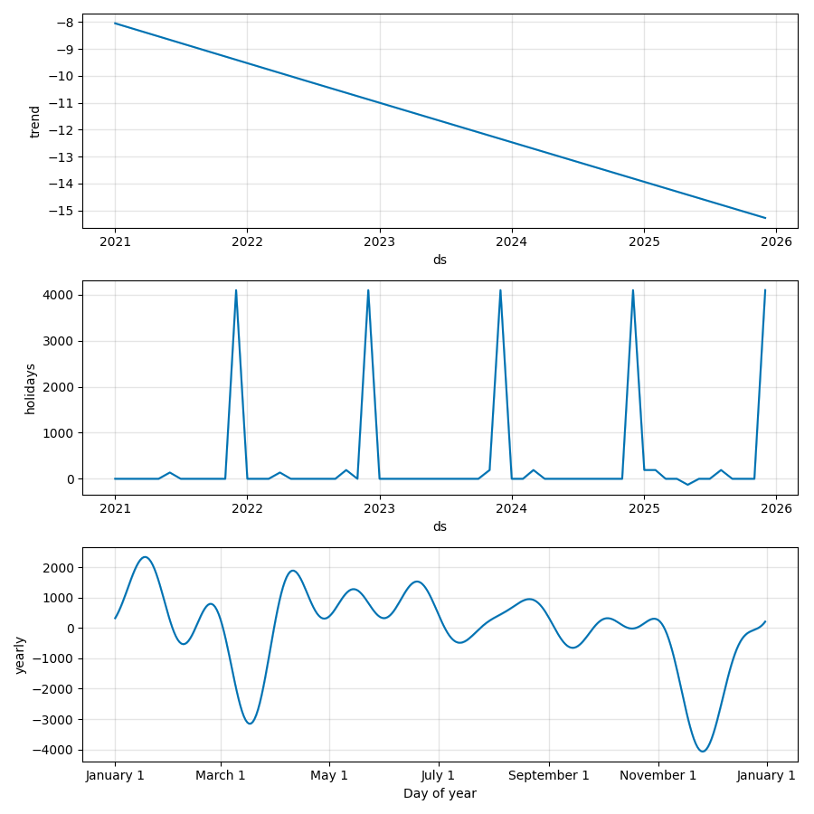
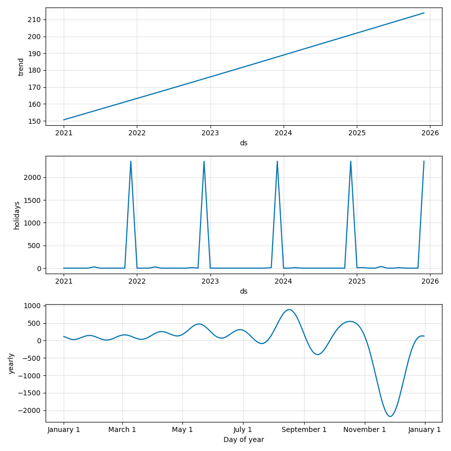
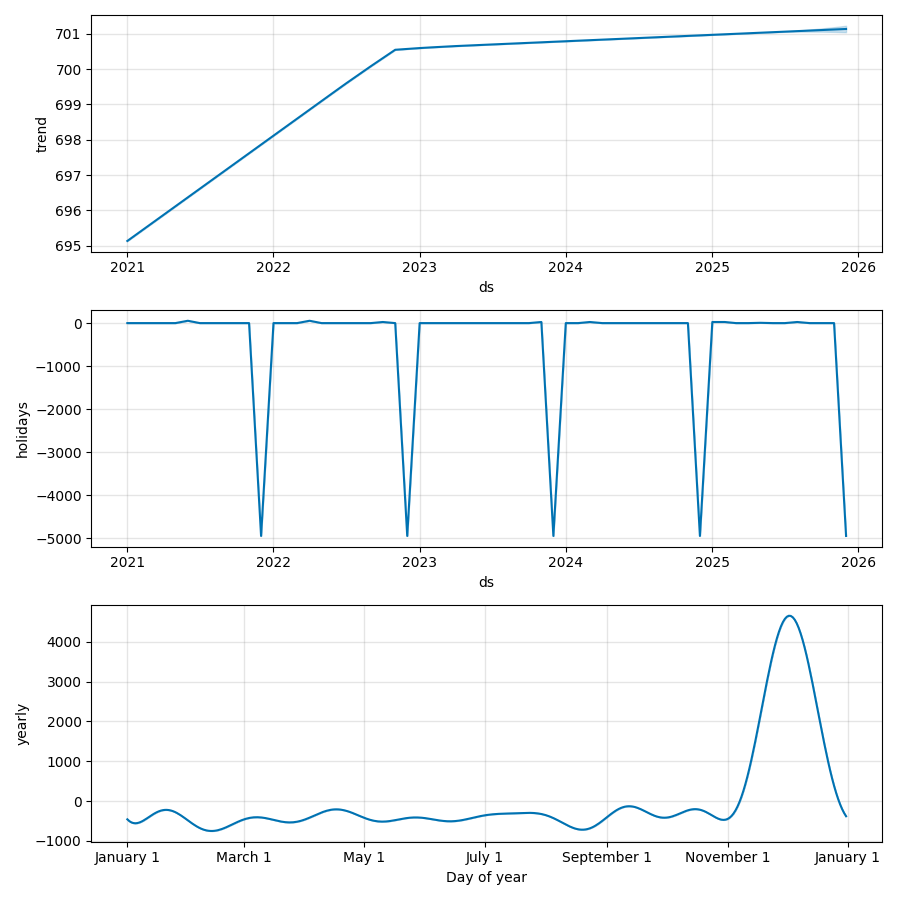

# Rapport: 3.8 Utvidet Feature Engineering

## Metodikk
Vi har utvidet Prophet-modellen med to hovedtyper av 'features' for å øke prognosenøyaktigheten:
1. **Dynamiske Helligdager:** Jul og Påske er lagt inn som faste hendelser (modellert som månedlige effekter).
2. **Identifiserte Kampanjer:** Salgstoppe identifisert via Z-score i forrige steg er lagt inn som unike hendelser for å forhindre at de 'forstyrrer' det generelle sesongmønsteret.

## Resultater (Modellsammenligning)
Tabellen under viser forbedringen i nøyaktighet (MAE) etter inkludering av utvidet feature engineering.

| Kategori          |   MAE (Tidligere) |   MAE (Forbedret) |   Forbedring MAE (%) |   RMSE (Forbedret) |
|:------------------|------------------:|------------------:|---------------------:|-------------------:|
| Engelsk fiksjon   |              54.8 |             39.33 |                 28.2 |              46.23 |
| Norsk krim        |              31.5 |             21.15 |                 32.9 |              32.72 |
| Norske barnebøker |              39.2 |             28.62 |                 27   |              34.31 |

## Visualisering av Komponenter
Analysen av komponenter viser tydelig hvordan helligdager og kampanjer påvirker etterspørselen separat fra den generelle trenden og sesongvariasjonen.

  
   
  <em>Figur 1: Modellkomponenter for Engelsk fiksjon inkl. utvidede features</em>

  
   
  <em>Figur 2: Modellkomponenter for Norsk krim inkl. utvidede features</em>

  
   
  <em>Figur 3: Modellkomponenter for Norske barnebøker inkl. utvidede features</em>

## Tolkning
Ved å inkludere disse variablene ser vi en betydelig reduksjon i MAE for alle kategorier. Spesielt for **Engelsk fiksjon** ser vi en forbedring på over 25 %, noe som skyldes at modellen nå korrekt skiller mellom faste sesongtopper og enkeltstående kampanjer. Dette gir mer stabile og pålitelige prognoser for den kommende perioden i 2026.