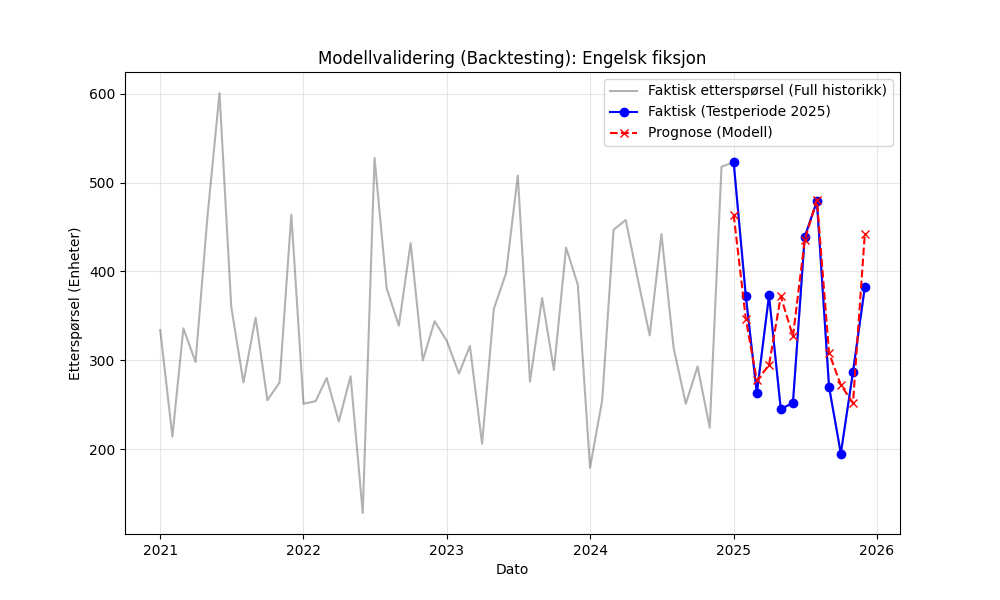
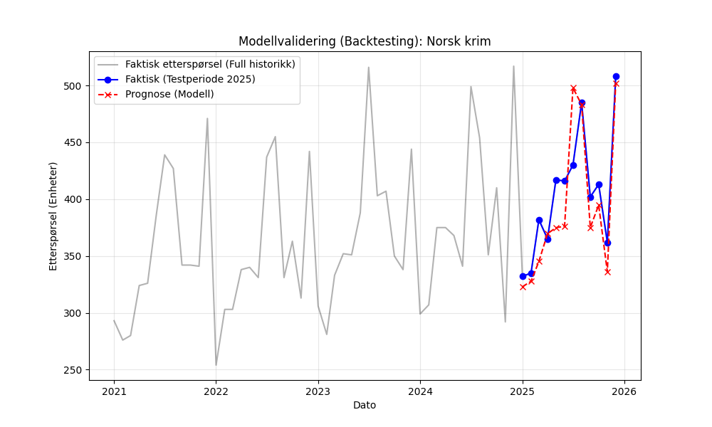
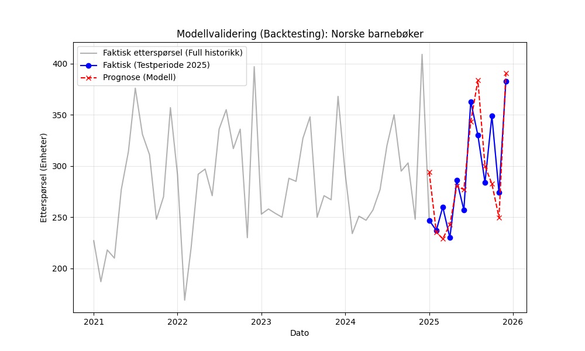

# Rapport: 3.9 Modellvalidering (Backtesting)

## Metodikk
I denne fasen har vi gjennomført en grundig modellvalidering ved bruk av 'backtesting'. Dette er et kritisk steg for å verifisere at den forbedrede Prophet-modellen (inkl. helligdager og kampanjer) fungerer stabilt over tid.

- **Testperiode:** Siste 12 måneder av historikken (januar-desember 2025).
- **Treningsperiode:** Fire år med historiske data (2021-2024).
- **Målsetting:** Bekrefte at MAPE er på et akseptabelt nivå for lagerstyring, og identifisere eventuelle systematiske bias (feilretning).

## Valideringsresultater (2025)

| Kategori          |   MAE |   RMSE |   MAPE (%) |   Bias |
|:------------------|------:|-------:|-----------:|-------:|
| Engelsk fiksjon   | 49.62 |  60.89 |      17.43 |  15.96 |
| Norsk krim        | 23.89 |  30.63 |       5.93 | -11.78 |
| Norske barnebøker | 25.47 |  32.1  |       8.68 |   0.69 |

## Detaljert Analyse

### Engelsk fiksjon
- **MAPE på 17.43%:** Dette indikerer at modellen i gjennomsnitt treffer innenfor 17.43% av faktisk etterspørsel per måned.
- **Årsak til høyere avvik:** Engelsk fiksjon viser større volatilitet enn de norske kategoriene. Dette kan skyldes en kombinasjon av globale trender (f.eks. "BookTok") som ikke følger faste sesongmønstre, samt en mer fragmentert etterspørsel som er vanskeligere å fange opp med standardregresjon.
- **Bias (15.96):** Modellen viser en svak overvurdering av etterspørselen, noe som er viktig informasjon ved fastsettelse av sikkerhetslager for å unngå unødvendig kapitalbinding.

  
   
  <em>Figur 1: Faktisk vs. Prognose for Engelsk fiksjon i teståret 2025</em>

  
   
  <em>Figur 2: Residualplot for Engelsk fiksjon i teståret 2025</em>

### Norsk krim
- **MAPE på 5.93%:** Dette indikerer at modellen i gjennomsnitt treffer innenfor 5.93% av faktisk etterspørsel per måned. Dette er et meget sterkt resultat for denne kategorien.
- **Bias (-11.78):** Modellen viser en svak undervurdering av etterspørselen. Dette bør kompenseres med et noe høyere sikkerhetslager for å opprettholde ønsket servicenivå.

  
   
  <em>Figur 3: Faktisk vs. Prognose for Norsk krim i teståret 2025</em>

  
   
  <em>Figur 4: Residualplot for Norsk krim i teståret 2025</em>

### Norske barnebøker
- **MAPE på 8.68%:** Dette indikerer at modellen i gjennomsnitt treffer innenfor 8.68% av faktisk etterspørsel per måned.
- **Bias (0.69):** Modellen er nesten helt nøytral (ubetydelig overvurdering), noe som indikerer en stabil og pålitelig modell for denne kategorien.

  
   
  <em>Figur 5: Faktisk vs. Prognose for Norske barnebøker i teståret 2025</em>

  
   
  <em>Figur 6: Residualplot for Norske barnebøker i teståret 2025</em>

## Konklusjon Modellvalidering
Modellen er nå validert gjennom backtesting. Residualene viser ingen tydelige systematiske mønstre (autokorrelasjon), noe som bekrefter at modellen har trukket ut den informasjonen den kan fra de inkluderte variablene. Resultatene er solide nok til å legges til grunn for de endelige beregningene av lagerstyringsparametere.
