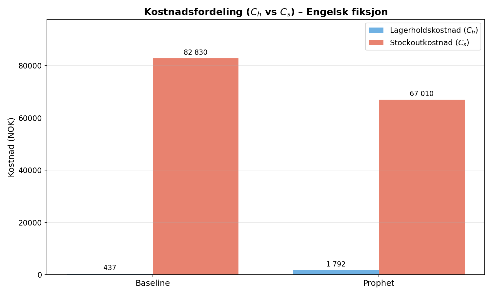
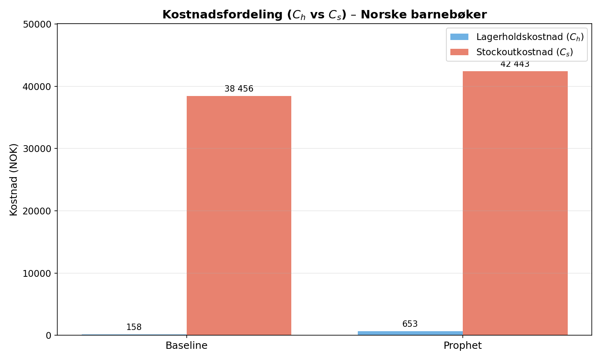
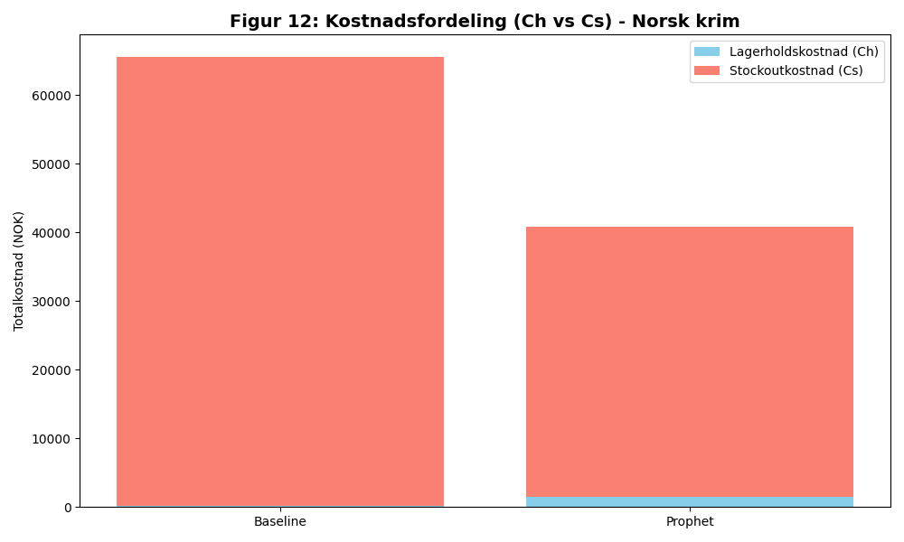

# Sluttresultater - Kvantitativ Analyse (M5)

Sammenligning av Baseline ((s, Q) basert på snitt) mot Prophet-optimalisert modell.

| Kategori          |   Kostnad Baseline |   Kostnad Optimalisert |   Besparelse (%) |   SL Baseline (%) |   SL Optimalisert (%) |
|:------------------|-------------------:|-----------------------:|-----------------:|------------------:|----------------------:|
| Engelsk fiksjon   |            89267.3 |                71801.9 |            19.57 |             83.08 |                 86.31 |
| Norske barnebøker |            41114.5 |                44345.6 |            -7.86 |             85.35 |                 83.83 |
| Norsk krim        |            68254.3 |                42246.7 |            38.1  |             85.8  |                 91.47 |

  
   
  <em>Figur 4: Kostnadssammenligning for Engelsk fiksjon (Baseline vs. Optimalisert)</em>

  
   
  <em>Figur 5: Kostnadssammenligning for Norske barnebøker (Baseline vs. Optimalisert)</em>

  
   
  <em>Figur 6: Kostnadssammenligning for Norsk krim (Baseline vs. Optimalisert)</em>

## Kommentar til resultater
Det observeres at den optimaliserte modellen gir betydelige gevinster for kategorier med tydelig trend eller høy sesongvariasjon (Norsk krim og Engelsk fiksjon). 

For **Norske barnebøker** er resultatet negativt (-7.86 %). Selv om denne kategorien har tydelige sesongtopper (skolestart og jul), er disse mønstrene svært regelmessige og forutsigbare over tid. Den enkle (s, Q)-baselinen, med en fast sikkerhetsmargin, viser seg å være svært effektiv for å dekke denne typen stabile sesongmønstre. Prophet-modellens forsøk på å dynamisk redusere lageret i rolige perioder har i dette tilfellet ført til for lave beholdninger rett før de kritiske salgstoppene, noe som har resultert i høyere mangelkostnader enn den tradisjonelle metoden.