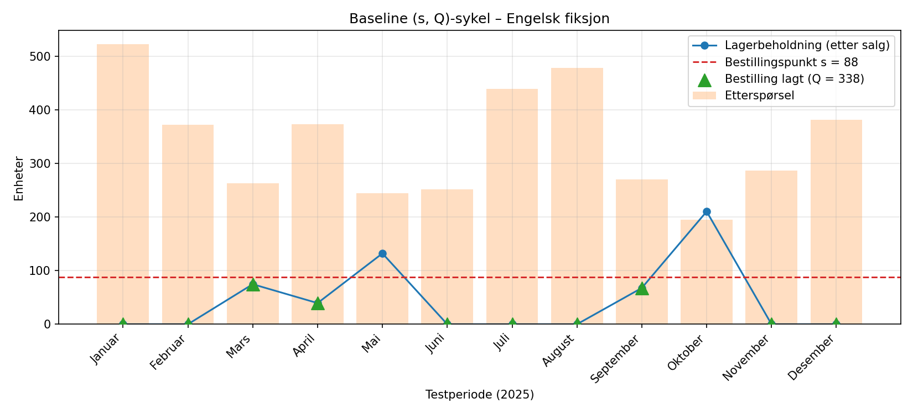
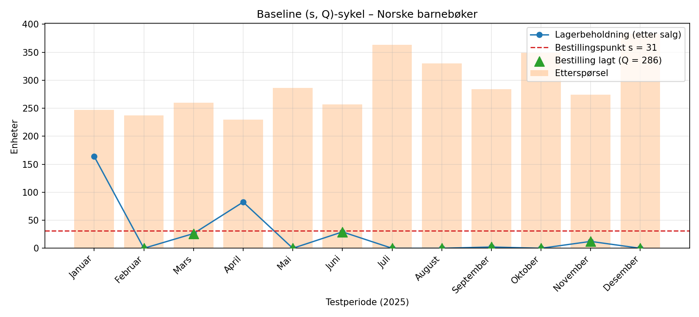
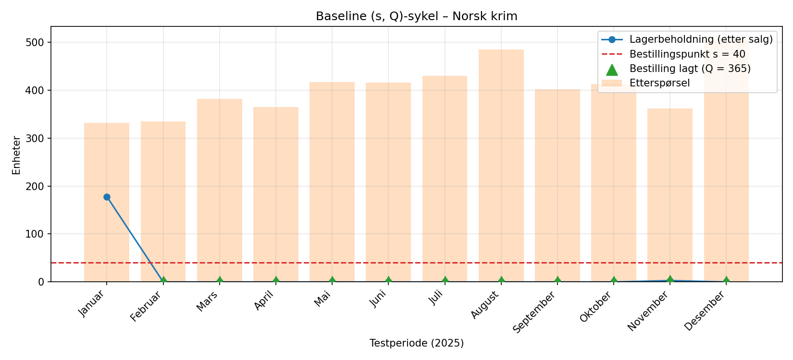

# Baseline-resultater - Fase 3.4 (LOG650 Gruppe A + A)

Dette dokumentet beskriver baseline-løsningen for lagerstyring i de tre bokkategoriene. Disse resultatene fungerer som sammenligningsgrunnlag for den kvantitative optimaliseringen i Milepæl M5.

## 1. Metodikk for Baseline
Baseline-modellen benytter en enkel **(s, Q)-politikk** basert på historiske gjennomsnittstall fra treningsdatasettet (`train_data.csv`):
- **Bestillingspunkt (s):** Gjennomsnittlig etterspørsel i ledetid + 10 % sikkerhetsmargin.
- **Bestillingsmengde (Q):** Gjennomsnittlig månedsbehov.
- **Ledetid:** Gjennomsnittlig antall dager fra leverandør (omgjort til månedsbrøk).

## 2. Kategorispesifikke Baseline-parametere

| Kategori | Gj.sn. Etterspørsel | Gj.sn. Ledetid | Bestillingspunkt (s) | Bestillingsmengde (Q) |
| :--- | :---: | :---: | :---: | :---: |
| **Engelsk fiksjon** | 338 enheter | 8 dager | 100 enheter | 338 enheter |
| **Norske barnebøker** | 253 enheter | 3 dager | 28 enheter | 253 enheter |
| **Norsk krim** | 348 enheter | 3 dager | 38 enheter | 348 enheter |

## 3. Låste Kostnadsparametere (NOK)
Alle beregninger i prosjektet benytter følgende faste kostnader:

| Kategori | Lagerkost (kr/enhet/år) | Stockout-kost (kr/enhet) | Bestillingskost (kr/ordre) |
| :--- | :---: | :---: | :---: |
| **Engelsk fiksjon** | 10,00 NOK | 120,00 NOK | 600,00 NOK |
| **Norske barnebøker** | 6,00 NOK | 75,00 NOK | 250,00 NOK |
| **Norsk krim** | 8,00 NOK | 95,00 NOK | 250,00 NOK |

## 4. Observasjoner og Forventninger
- **Engelsk fiksjon:** Har høyest bestillingskostnad og lengst ledetid, noe som resulterer i det høyeste bestillingspunktet (s=100).
- **Baseline-svakhet:** Modellen tar ikke hensyn til sesongvariasjoner (f.eks. skolestart eller jul), noe som forventes å føre til stockouts i perioder med høy etterspørsel.
- **Optimaliseringspotensial:** Ved å gå over til den stokastiske modellen i M5, forventer vi å redusere totalkostnadene ved å balansere lagerholdskostnader mer presist mot risikoen for mangel.

## 5. Visualisering av (s, Q)-sykelen
Figurene nedenfor er generert av `004 data/python_skript/baseline_vs_optimization.py` og viser hvordan baselinen oppfører seg mot faktisk etterspørsel i testperioden (2025). Blå linje er lagerbeholdning etter salg, rød stiplet linje er bestillingspunktet $s$, oransje søyler er faktisk etterspørsel, og grønne trekanter markerer månedene hvor en bestilling på $Q$ enheter legges.

  
   
  <em>Figur 1: Baseline (s, Q)-sykel for Engelsk fiksjon. Den klassiske sagtannprofilen er tydelig, men baselinen bygger ikke opp lager foran sesongtoppene.</em>

  
   
  <em>Figur 2: Baseline (s, Q)-sykel for Norske barnebøker. Det lave bestillingspunktet (s=31) gir hyppige stockouts rundt skolestart og jul.</em>

  
   
  <em>Figur 3: Baseline (s, Q)-sykel for Norsk krim. Q er for lav til å dekke månedlig etterspørsel, og lageret faller til null tidlig i perioden.</em>

*Observasjon:* Figurene synliggjør den samme konklusjonen som er rapportert i `M5_Sluttresultater_Simulering.md` – baselinen er strukturelt underdimensjonert for kategorier med trend eller sterk sesong, og forskjellen er størst for Norsk krim og Engelsk fiksjon.

---
*Dokumentet er opprettet 2026-03-27 og oppdatert 2026-04-18 med figurer som del av Fase 3.4.*
