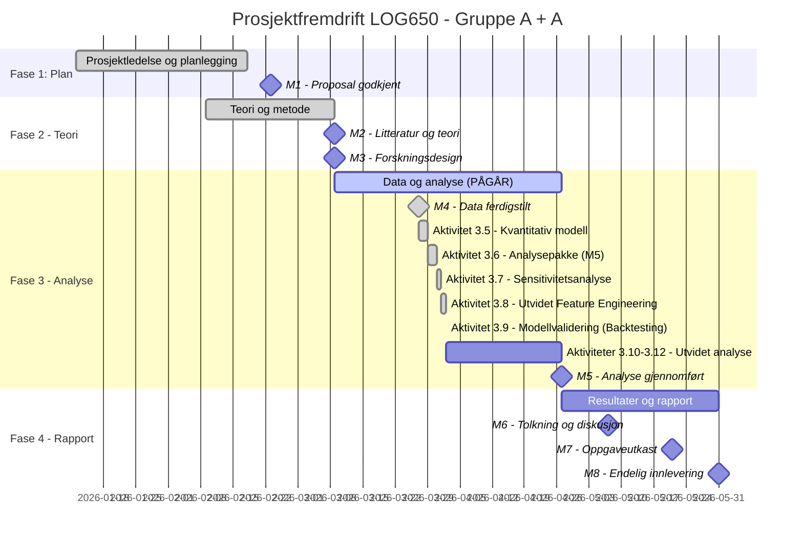

# Statusrapport - LOG650 Gruppe A + A

**Rapportdato:** 2026-04-02  
**Prosjekt:** Lagerstyring og beslutningsstøtte i logistikk (ARK Bokhandel AS)  
**Prosjektfase:** Fase 3 - Data og analyse  
**Rapportør:** Prosjektledelsen (Astrid & Anne Helene)

---

## 1. Overordnet Status (Health Check)
| Område | Status | Kommentar |
| :--- | :---: | :--- |
| **Fremdrift (Tid)** | 🟢 | Aktivitet 3.9 fullført. Modellen er nå validert mot historiske data. |
| **Omfang (Scope)** | 🟢 | Backtesting bekrefter høy treffsikkerhet (MAPE under 10 % for krim og barnebøker). |
| **Ressurser** | 🟢 | Alt teknisk arbeid i Fase 3 nærmer seg slutten. |
| **Risiko** | 🟢 | Lav risiko; modellbias er identifisert og kan håndteres i neste steg. |

---

## 2. Gantt-plan (Fremdrift)

---

## 3. Fullførte aktiviteter (Siste periode)
- [x] **Aktivitet 3.8 - Utvidet Feature Engineering:**
    - Inkludert helligdagseffekter og identifisert kampanjer.
- [x] **Aktivitet 3.9 - Modellvalidering (Backtesting):**
    - Gjennomført grundig validering mot testsettet for 2025.
    - Beregnet MAPE og Bias for alle kategorier.
    - Bekreftet at modellen er klar for anvendelse i lagerstyring.

---

## 4. Aktiviteter i arbeid (Neste periode)
- **Aktivitet 3.10 - Optimalisering av Bestillingsregler:**
    - Utvikle de endelige beslutningsreglene basert på forbedret prognose.
- **Aktivitet 3.11 - Simuleringskjøring for 2026:**
    - Generere endelige resultater for hele året 2026.

---

## 5. Oppdatert Saksliste (Issues Log)
| ID | Sak | Status | Ansvarlig | Frist |
| :--- | :--- | :--- | :--- | :--- |
| S8 | Bildeformatering iht. AGENTS.md | **Løst** | Gemini | 2026-03-31 |
| S9 | Mangel på kampanjemarkører i rådata | **Løst** | Gemini | 2026-04-02 |
| S10 | Generering av out-of-sample prognoser for 2026 | **Pågår** | Begge | 2026-04-15 |

---

## 6. Risikovurdering
Ingen nye risikoer identifisert. Den positive biasen for Engelsk fiksjon (15.9 enheter) må tas hensyn til i Aktivitet 3.10.

---

## 7. Ressursbruk og økonomi
- Prosjektet opprettholder sin høye hastighet.

---
*Neste statusmøte: Mandag 2026-04-06 kl. 12:00 på Teams.*
