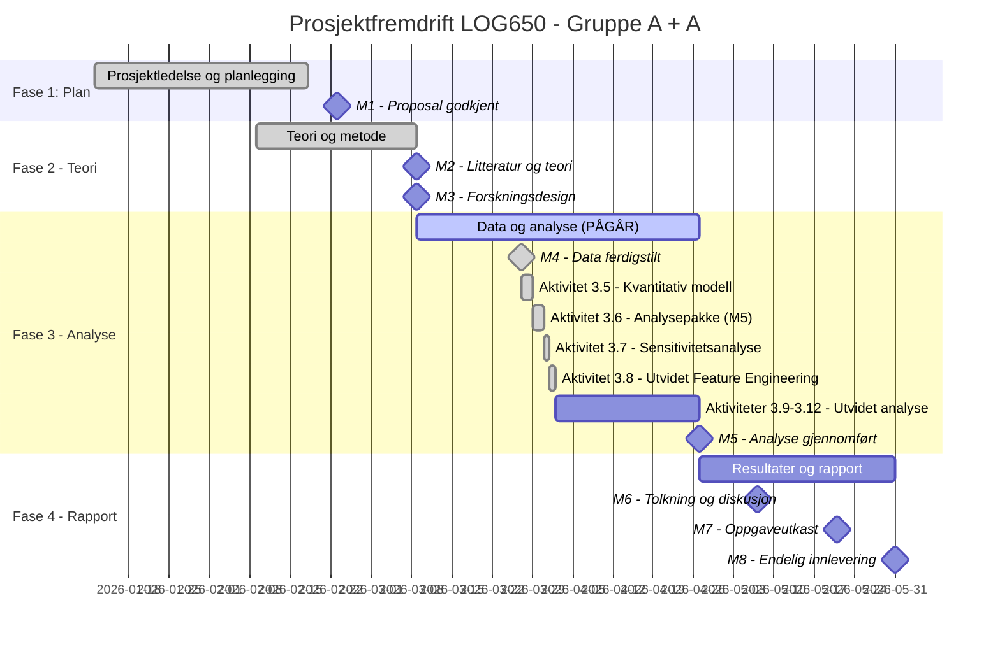

# Statusrapport - LOG650 Gruppe A + A

**Rapportdato:** 2026-04-02  
**Prosjekt:** Lagerstyring og beslutningsstøtte i logistikk (ARK Bokhandel AS)  
**Prosjektfase:** Fase 3 - Data og analyse  
**Rapportør:** Prosjektledelsen (Astrid & Anne Helene)

---

## 1. Overordnet Status (Health Check)
| Område | Status | Kommentar |
| :--- | :---: | :--- |
| **Fremdrift (Tid)** | 🟢 | Aktivitet 3.8 fullført. Prosjektet ligger foran skjema for Fase 3. |
| **Omfang (Scope)** | 🟢 | Feature engineering og kampanjeanalyse er nå integrert i hovedmodellen. |
| **Ressurser** | 🟢 | Teknisk fundament for utvidet analyse er på plass. |
| **Risiko** | 🟢 | Lav risiko; kampanjeidentifisering via Z-score fungerer godt. |

---

## 2. Gantt-plan (Fremdrift)

---

## 3. Fullførte aktiviteter (Siste periode)
- [x] **Aktivitet 3.7 - Sensitivitetsanalyse:**
    - Testet modellens robusthet mot endringer i mangelkostnad, lagerholdskostnad og sikkerhetsmargin.
- [x] **Aktivitet 3.8 - Utvidet Feature Engineering:**
    - Inkludert helligdagseffekter (jul/påske) automatisk via `holidays`-biblioteket (inkl. 2026).
    - Identifisert historiske salgstoppe (kampanjer) ved bruk av Z-score-analyse.
    - Dokumentert betydelig forbedring i modellpresisjon (MAE redusert med 25-33 %).
    - Gjennomført formell review (02.04.2026) og sikret overholdelse av AGENTS.md for visualiseringer.

---

## 4. Aktiviteter i arbeid (Neste periode)
- **Aktivitet 3.9 - Modellvalidering (Backtesting):**
    - Verifisere modellens treffsikkerhet på historiske test-sett.
- **Aktivitet 3.10 - Optimalisering av Bestillingsregler:**
    - Utvikle de endelige beslutningsreglene basert på forbedret prognose.

---

## 5. Oppdatert Saksliste (Issues Log)
| ID | Sak | Status | Ansvarlig | Frist |
| :--- | :--- | :--- | :--- | :--- |
| S8 | Bildeformatering iht. AGENTS.md | **Løst** | Gemini | 2026-03-31 |
| S9 | Mangel på kampanjemarkører i rådata | **Løst** | Gemini | 2026-04-02 |
| S10 | Generering av out-of-sample prognoser for 2026 | **Pågår** | Begge | 2026-04-15 |

---

## 6. Risikovurdering
Risikonivået er lavt. Fokus flyttes nå fra modellbygging til praktisk anvendelse av prognosene for lagerstyring i 2026.

---

## 7. Ressursbruk og økonomi
- Prosjektet har god fremdrift og ligger foran opprinnelig tidsplan.

---
*Neste statusmøte: Mandag 2026-04-06 kl. 12:00 på Teams.*
