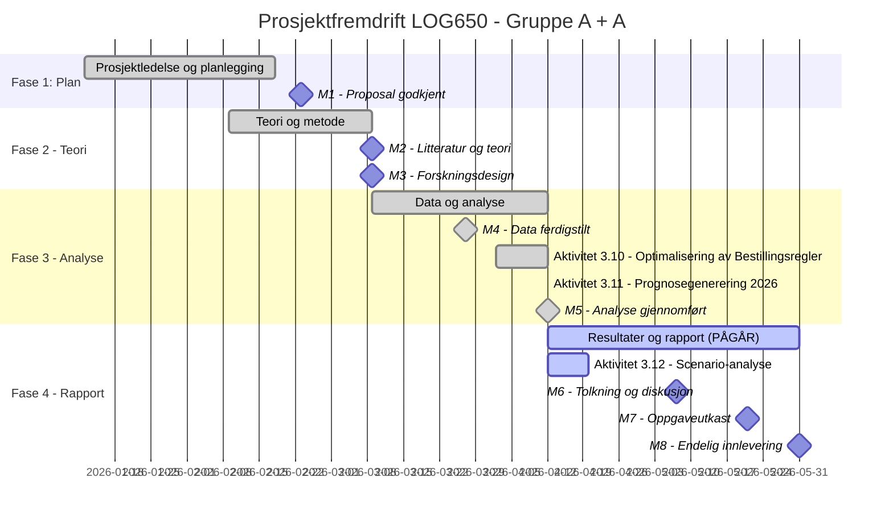

# Statusrapport - LOG650 Gruppe A + A

**Rapportdato:** 2026-04-12  
**Prosjekt:** Lagerstyring og beslutningsstøtte i logistikk (ARK Bokhandel AS)  
**Prosjektfase:** Fase 4 - Resultater og rapport (PÅBEGYNT)  
**Rapportør:** Prosjektledelsen (Astrid & Anne Helene)

---

## 1. Overordnet Status (Health Check)
| Område | Status | Kommentar |
| :--- | :---: | :--- |
| **Fremdrift (Tid)** | 🟢 | Aktivitet 3.11 fullført. Alle prognoser for 2026 er generert. |
| **Omfang (Scope)** | 🟢 | M5 er nådd. Kvantitativ analyse er komplett. |
| **Ressurser** | 🟢 | Fokus skifter nå fra koding/analyse til tolkning og rapportskriving. |
| **Risiko** | 🟢 | Lav risiko; modellresultatene er stabile og valide. |

---

## 2. Gantt-plan (Fremdrift)

---

## 3. Fullførte aktiviteter (Siste periode)
- [x] **Aktivitet 3.10 - Optimalisering av Bestillingsregler:**
    - Faststatt kategori-spesifikke sikkerhetsfaktorer og bias-justering.
- [x] **Aktivitet 3.11 - Prognosegenerering 2026:**
    - Generert endelige etterspørselsprognoser og bestillingspunkter for hele 2026.
    - Produsert visualiseringer av sikkerhetslagersoner for alle kategorier.
- [x] **Milepæl M5 - Kvantitativ analyse gjennomført:**
    - Alle tekniske analyseaktiviteter i Fase 3 er nå fullført.

---

## 4. Aktiviteter i arbeid (Neste periode)
- **Aktivitet 3.12 - Scenario-analyse:**
    - Teste hvordan prognosen påvirkes av ekstreme kampanjeløft eller endrede kostnader i 2026.
- **Fase 4 - Rapportskriving:**
    - Begynne på kapittel 8 (Resultater) med fokus på 2026-tallene.

---

## 5. Oppdatert Saksliste (Issues Log)
| ID | Sak | Status | Ansvarlig | Frist |
| :--- | :--- | :--- | :--- | :--- |
| S10 | Generering av out-of-sample prognoser for 2026 | **Løst** | Gemini | 2026-04-12 |
| S11 | Scenario-oppsett for kampanjeløft | **Ny** | Begge | 2026-04-20 |

---

## 6. Risikovurdering
Ingen nye risikoer identifisert. Prosjektet går nå over i en fase med mer akademisk refleksjon.

---

## 7. Ressursbruk og økonomi
- Prosjektet opprettholder sin høye hastighet.

---
*Neste statusmøte: Mandag 2026-04-13 kl. 12:00 på Teams.*
