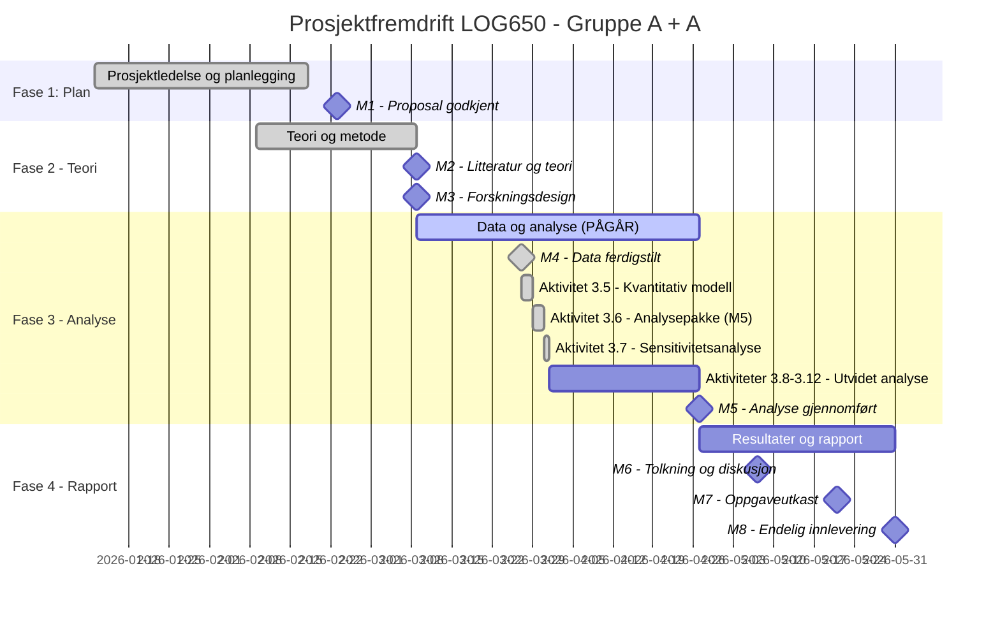

# Statusrapport - LOG650 Gruppe A + A

**Rapportdato:** 2026-03-31  
**Prosjekt:** Lagerstyring og beslutningsstøtte i logistikk (ARK Bokhandel AS)  
**Prosjektfase:** Fase 3 - Data og analyse  
**Rapportør:** Prosjektledelsen (Astrid & Anne Helene)

---

## 1. Overordnet Status (Health Check)
| Område | Status | Kommentar |
| :--- | :---: | :--- |
| **Fremdrift (Tid)** | 🟢 | Aktivitet 3.6 fullført og godkjent. Nye aktiviteter lagt til i Fase 3. |
| **Omfang (Scope)** | 🟢 | Utvidet scope med feature engineering og kampanjeanalyse. |
| **Ressurser** | 🟢 | God fremdrift; teknisk fundament er nå på plass. |
| **Risiko** | 🟢 | Fokus på modellrobusthet og prediksjonskraft for 2026. |

---

## 2. Gantt-plan (Fremdrift)

---

## 3. Fullførte aktiviteter (Siste periode)
- [x] **Aktivitet 3.6 - Analysepakke (M5):**
    - Sammenstilt resultater fra Prophet-optimalisering mot baseline for alle kategorier.
    - Gjennomført formell review (31.03.2026) med fokus på AGENTS.md-standarder.
    - Implementert korrekt bildeformatering og visuelle referanser i oppsummeringsdokumentene.
- [x] **Aktivitet 3.7 - Sensitivitetsanalyse:**
    - Testet modellens robusthet mot endringer i mangelkostnad, lagerholdskostnad og sikkerhetsmargin.
    - Identifisert at økt sikkerhetsmargin (faktor 1.5-2.0) gir betydelige gevinster for Engelsk fiksjon og Norske barnebøker.
- [x] **Milepæl M5 Oppdatering:** Bekreftet fullføring av den initielle kvantitative analysen.
- [x] **Utvidelse av prosjektplan:** Lagt til fem nye aktiviteter (3.8-3.12) for å styrke analysens dybde (kampanjeløft, feature engineering, prognoser 2026).

---

## 4. Aktiviteter i arbeid (Neste periode)
- **Aktivitet 3.8 - Utvidet Feature Engineering:**
    - Inkludere helligdagseffekter og identifisere historiske salgstoppe (kampanjer).
- **Aktivitet 3.9 - Modellvalidering (Backtesting):**
    - Verifisere modellens treffsikkerhet på historiske test-sett.

---

## 5. Oppdatert Saksliste (Issues Log)
| ID | Sak | Status | Ansvarlig | Frist |
| :--- | :--- | :--- | :--- | :--- |
| S8 | Bildeformatering iht. AGENTS.md | **Løst** | Gemini | 2026-03-31 |
| S9 | Mangel på kampanjemarkører i rådata | **Pågår** | Begge | 2026-04-10 |
| S10 | Generering av out-of-sample prognoser for 2026 | **Ny** | Begge | 2026-04-15 |

---

## 6. Risikovurdering
Risiko knyttet til **S9 (mangel på kampanjedata)** håndteres ved å bruke residualanalyse for å identifisere sannsynlige kampanjer retrospektivt. Dette krever ekstra metodisk nøyaktighet i Aktivitet 3.10.

---

## 7. Ressursbruk og økonomi
- Prosjektet har god fremdrift, noe som har gitt rom for å utvide analysen uten å utsette sluttdatoen for Fase 3 (27. april).

---
*Neste statusmøte: Mandag 2026-04-06 kl. 12:00 på Teams.*
