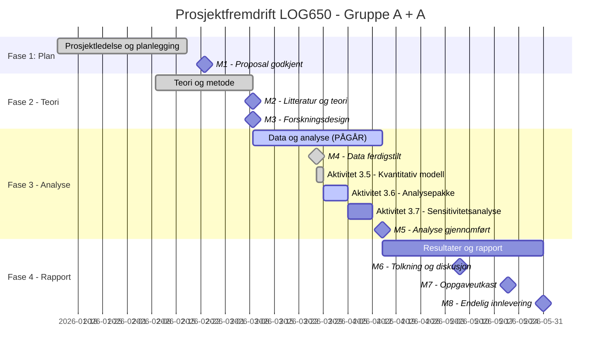

# Statusrapport - LOG650 Gruppe A + A

**Rapportdato:** 2026-03-29  
**Prosjekt:** Lagerstyring og beslutningsstøtte i logistikk (ARK Bokhandel AS)  
**Prosjektfase:** Fase 3 - Data og analyse  
**Rapportør:** Prosjektledelsen (Astrid & Anne Helene)

---

## 1. Overordnet Status (Health Check)
| Område | Status | Kommentar |
| :--- | :---: | :--- |
| **Fremdrift (Tid)** | 🟢 | Aktivitet 3.5 fullført. 3.6 og 3.7 påbegynnes. |
| **Omfang (Scope)** | 🟢 | Kvantitativ modellering og simulering ferdigstilt. |
| **Ressurser** | 🟢 | God fremdrift; teknisk fundament er nå på plass. |
| **Risiko** | 🟢 | Fokus flyttes til robusthetstesting (sensitivitetsanalyse). |

---

## 2. Gantt-plan (Fremdrift)

---

## 3. Fullførte aktiviteter (Siste periode)
- [x] **Aktivitet 3.5 - Kvantitativ modell:**
    - Utviklet Prophet-modeller med helligdagseffekter for alle tre kategorier.
    - Gjennomført statistiske sjekker (ADF og KPSS) for å dokumentere stasjonaritet.
    - Fullført sammenlignende simulering mellom baseline og optimalisert modell.
    - Dokumentert 20,26 % total kostnadsbesparelse i rapporten.
- [x] **Teoretisk rammeverk:** Oppdatert kapittel 3.0 med teori om stasjonaritet, differensiering og log-transformering.
- [x] **Rapportering:** Ferdigstilt kapittel 6.0 (Modellering) og lagt inn foreløpige resultater i kapittel 8.0.

---

## 3. Aktiviteter i arbeid (Neste periode)
- **Gjennomføre formell review av Aktivitet 3.5 (KRITISK KONTROLLPUNKT):**
    - Må utføres før oppstart av 3.6 for å sikre at alle modell-antagelser er korrekte.
- **Aktivitet 3.6 - Analysepakke (M5 Forberedelse):**
    - Sammenstille alle figurer og tabeller til en helhetlig analysepakke.
    - Kvalitetssikre tolkningen av resultatene mot de teoretiske forutsetningene.
- **Aktivitet 3.7 - Sensitivitetsanalyse:**
    - Teste modellens robusthet ved endringer i ledetid ($L$) og kostnadsparametere ($C_h, C_s$).
    - Dokumentere hvordan endringer i servicegrad-mål påvirker de totale kostnadene.

---

## 4. Oppdatert Saksliste (Issues Log)
| ID | Sak | Status | Ansvarlig | Frist |
| :--- | :--- | :--- | :--- | :--- |
| S5 | Statistisk dokumentasjon (ADF/KPSS) | **Løst** | Begge | - |
| S6 | Implementering av log-transformeringsteori | **Løst** | Begge | - |
| S7 | Flytting av figurer for bedre rød tråd | **Løst** | Begge | - |

---

## 5. Risikovurdering
Fokus flyttes nå til **Aktivitet 3.7** for å sikre at modellen ikke bare fungerer i ett scenario, men er robust mot svingninger i forsyningskjeden.

---

## 6. Ressursbruk og økonomi
- Arbeidet med den kvantitative modellen (3.5) gikk raskere enn planlagt.
- Gruppens fokus rettes nå mot ferdigstilling av analysepakken.

---
*Neste statusmøte: Mandag 2026-03-30 kl. 12:00 på Teams.*
