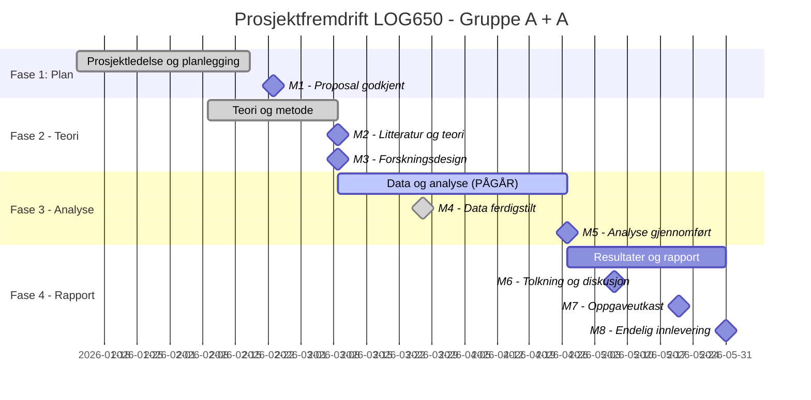

# Statusrapport - LOG650 Gruppe A + A

**Rapportdato:** 2026-03-27  
**Prosjekt:** Lagerstyring og beslutningsstøtte i logistikk (ARK Bokhandel AS)  
**Prosjektfase:** Fase 3 - Data og analyse  
**Rapportør:** Prosjektledelsen (Astrid & Anne Helene)

---

## 1. Overordnet Status (Health Check)
| Område | Status | Kommentar |
| :--- | :---: | :--- |
| **Fremdrift (Tid)** | 🟢 | M4 fullført før plan. Fase 3.4 påbegynt. |
| **Omfang (Scope)** | 🟢 | Datagrunnlag låst og verifisert (M4). |
| **Ressurser** | 🟢 | God kapasitet og effektiv arbeidsfordeling i gruppen. |
| **Risiko** | 🟢 | Datakvalitet (RI1) er bekreftet gjennom M4-leveransen. |

---

## 2. Gantt-plan (Fremdrift)

---

## 3. Fullførte aktiviteter (Siste periode)
- [x] **Milepæl M4:** Datagrunnlag (simulerte data) ferdigstilt og verifisert.
- [x] **Fase 3.4 - Baseline-løsning:** Etablert baseline-parametere (s, Q) for alle tre bokkategorier (Engelsk fiksjon, Norsk krim, Norske barnebøker).
- [x] **Dokumentasjon:** Opprettet `006 analysis\Baseline_Resultater.md` med oversikt over baseline-tall og kostnadsparametere i NOK.
- [x] **Analyseverktøy:** Utviklet Python-skript for sammenligning mellom baseline og optimalisert modell.

---

## 3. Aktiviteter i arbeid (Neste periode)
- **Milepæl M5 - Kvantitativ analyse (Påbegynnes):**
    - Utvikle stokastisk optimaliseringsmodell (EOQ + sikkerhetslager-optimalisering).
    - Gjennomføre sammenlignende analyse mellom baseline og optimalisert modell for alle kategorier.
    - Beregne potensielle kostnadsbesparelser og forbedring i servicegrad.
- **Rapportering:** Starte på utkastet til analysedelen i `rapport.md`.

---

## 4. Oppdatert Saksliste (Issues Log)
| ID | Sak | Status | Ansvarlig | Frist |
| :--- | :--- | :--- | :--- | :--- |
| S1 | Valg av stockout-kostnad vs. servicegrad | **Løst** | Begge | - |
| S2 | Fastsette realistiske kostnadsparametere | **Løst** | Begge | - |
| S3 | Kalibrering av sesongvariasjoner i datagenerator | **Løst** | Begge | - |
| S4 | Optimalisering av WBS/Gantt i MS Project | **Fullført** | Begge | - |

---

## 5. Risikovurdering
Risikoen for datakvalitet (**RI1**) er nå betydelig redusert etter fullføring av M4. Fokus flyttes nå til **RI2: Modellkompleksitet** – sikre at optimaliseringsmodellen er robust, men samtidig enkel nok til å tolkes i rapporten.

---

## 6. Ressursbruk og økonomi
- Arbeidet ligger foran skjema for Fase 3.
- God flyt i samarbeidet; ingen flaskehalser identifisert.

---
*Neste statusmøte: Mandag 2026-03-30 kl. 12:00 på Teams.*
