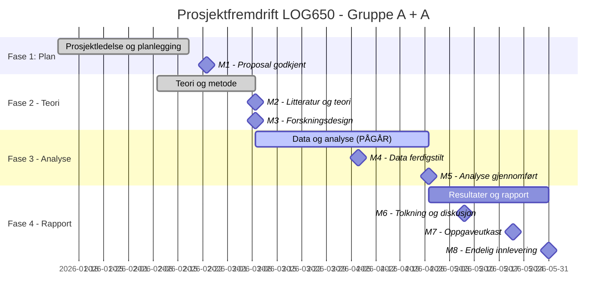

# Statusrapport - LOG650 Gruppe A + A

**Rapportdato:** 2026-03-22  
**Prosjekt:** Lagerstyring og beslutningsstøtte i logistikk (ARK Bokhandel AS)  
**Prosjektfase:** Fase 3 - Data og analyse  
**Rapportør:** Prosjektledelsen (Astrid & Anne Helene)

---

## 1. Overordnet Status (Health Check)
| Område | Status | Kommentar |
| :--- | :---: | :--- |
| **Fremdrift (Tid)** | 🟢 | Fase 2 fullført på plan. Fase 3 er i gang. |
| **Omfang (Scope)** | 🟢 | Problemstilling og metodisk rammeverk er låst (M1-M3). |
| **Ressurser** | 🟢 | God kapasitet og effektiv arbeidsfordeling i gruppen. |
| **Risiko** | 🟡 | Kritisk fase for datagenerering (M4) er påbegynt. |

---

## 2. Gantt-plan (Fremdrift)

---

## 3. Fullførte aktiviteter (Siste periode)
- [x] **Milepæl M2:** Litteraturgrunnlag og teoriramme ferdigstilt. Definert sentrale begreper som lagerholdskostnader og servicegrad.
- [x] **Milepæl M3:** Forskningsdesign og metode fastsatt. Valg av simuleringsmodell og evalueringskriterier er låst.
- [x] **Intern Fagfellevurdering:** Gjennomført kameratsjekk av metodekapittelet.
- [x] **Oppsett av analyseverktøy:** Verifisert Python/Excel-miljø for simulering.

---

## 3. Aktiviteter i arbeid (Neste periode)
- **Ferdigstille Milepæl M4 (Frist: 07.04.26):**
    - Utvikle datagenerator for simulerte salgsdata.
    - Legge inn sesongvariasjoner (skolestart, jul, påske).
    - Gjennomføre plausibilitetssjekk av generert data mot realistiske bokhandeltall.
- **Påbegynne Fase 3.4 - Baseline-løsning:**
    - Implementere enkel bestillingsregel (historisk snitt) for sammenligning.
- **Dokumentasjon:** Oppdatere datadokumentasjon og antakelser løpende.

---

## 4. Oppdatert Saksliste (Issues Log)
| ID | Sak | Status | Ansvarlig | Frist |
| :--- | :--- | :--- | :--- | :--- |
| S1 | Valg av stockout-kostnad vs. servicegrad | **Løst** | Begge | - |
| S2 | Fastsette realistiske kostnadsparametere | Pågår | Begge | 01.04.26 |
| S3 | Kalibrering av sesongvariasjoner i datagenerator | Pågår | Begge | 07.04.26 |
| S4 | Optimalisering av WBS/Gantt i MS Project | Fullført | Begge | - |

---

## 5. Risikovurdering
Det største fokusområdet nå er **RI1: Datakvalitet**. Siden vi benytter simulerte data, er vi avhengige av at disse er robuste nok til å gi meningsfulle resultater i den kvantitative modellen. 
- *Tiltak:* Vi planlegger en ekstra intern review av datagrunnlaget rett før M4 for å sikre validitet.

---

## 6. Ressursbruk og økonomi
- Arbeidet følger estimert tidsbruk for Fase 3.
- Begge prosjektmedlemmer har avsatt tilstrekkelig tid i de kommende to ukene for å nå M4.
- Ingen eksterne kostnader påløpt.

---
*Neste statusmøte: Mandag 2026-03-30 kl. 12:00 på Teams.*
